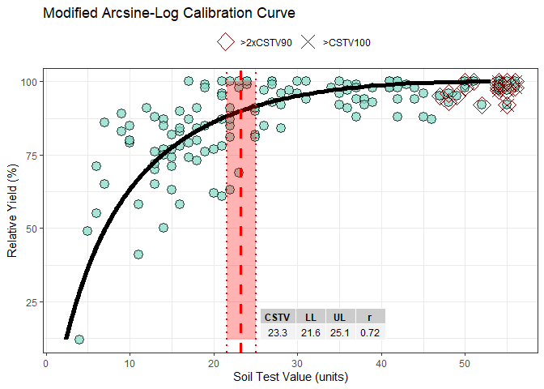
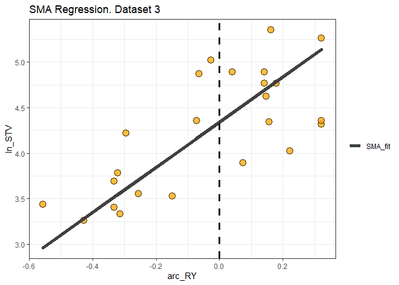
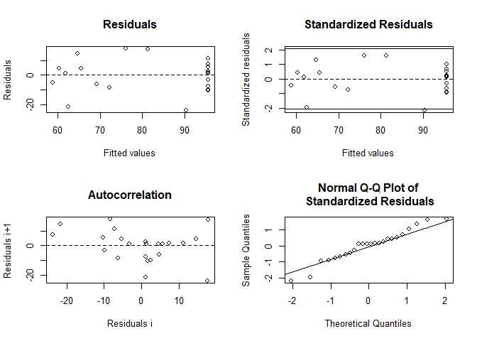

<!-- README.md is generated from README.Rmd. Please edit that file -->

# soiltestR: Soil Test Calibration in R

<!-- badges: start -->

[](https://ci.appveyor.com/project/adriancorrendo/soiltestR)
[](https://circleci.com/gh/adriancorrendo/soiltestR)
[](https://app.codecov.io/gh/adriancorrendo/modalcc?branch=main)
[](https://github.com/adriancorrendo/soiltestR/actions)
<!-- badges: end -->

# Description <br/>

The goal of `soiltestR` is to assist users on the analysis of
relationships between relative yield (RY) and soil test values (STV)
following different approaches. <br/>


<b> 1. modALCC() </b> <br/>

The first calibration method available is the Modified Arcsine-log
Calibration Curve (`modALCC()`) originally described by Dyson and
Conyers (2013) and modified by Correndo et al. (2017). This function
produces the estimation of critical soil test values (CSTV) for a target
relative yield (RY) with confidence intervals at adjustable confidence
levels. <br/>

Instructions <br/>

1.  Load your dataframe with soil test value (STV) and relative yield
    (RY) data. <br/>

2.  Specify the following arguments into the function -modALCC()-: <br/>

(a). `data` (optional), <br/>

(b). soil test value `STV` and relative yield `RY`, <br/>

(c). `target` of relative yield (e.g. 90%), <br/>

(d). desired `confidence` level (e.g. 0.95 for 1 - alpha(0.05)). Used
for the estimation of critical soil test value (CSTV) lower and upper
limits. <br/>

3.  Run and check results. <br/>

4.  Check residuals plot, and warnings related to potential leverage
    points. <br/>

5.  Adjust curve plots as desired. <br/>

`soiltestR` also allows users to implement the quadrants analysis
approach, also known as the Cate-Nelson analysis. There are two versions
of the Cate-Nelson technique: <br/>

<b> 2. cate_nelson_1965() </b> <br/>

The second alternative is based on Cate and Nelson (1965)
(`cate_nelson_1965()`). The first step of this method is to apply an
arbitrarily fixed value of RY as a target (y-axis) that divides the data
into two categories (below & equal or above RY target). In a second
stage, it estimates the CSTV (x-axis) as the minimum STV that divides
the data into four quadrants (target RY level combined with STV lower or
greater than the CSTV) maximizing the number of points under
well-classified quadrants (II, STV \>= CSTV & RY \>= RY target; and IV,
STV \< CSTV & RY \< RY target). This is also known as the “graphical”
version of the Cate-Nelson approach. <br/>

Instructions <br/>

1.  Load your dataframe with soil test value (STV) and relative yield
    (RY) data. <br/>

2.  Specify the following arguments into the function
    -cate_nelson_1965()-: <br/>

(a). `data` (optional), <br/>

(b). soil test value `STV` and relative yield `RY`, <br/>

(c). `target` of relative yield (e.g. 90%), <br/>

3.  Run and check results. <br/>

4.  Adjust plot as desired. <br/>

<b> 3. cate_nelson_1971() </b> <br/>

The third alternative is based on Cate and Nelson (1971)
(`cate_nelson_1971()`). The first step of this alternative version is to
estimates the CSTV (x-axis) as the minimum STV that minimizes the
residual sum of squares when dividing data points in two classes (lower
or greater than the CSTV) without using a fixed RY. This refined version
does not constrains the model performance (measured with the coefficient
of determination -R2-) but the user has no control on the RY level for
the CSTV. This is also known as the “statistical” version of the
Cate-Nelson approach. <br/>

Instructions <br/>

1.  Load your dataframe with soil test value (STV) and relative yield
    (RY) data. <br/>

2.  Specify the following arguments into the function
    -cate_nelson_1965()-: <br/>

(a). `data` (optional), <br/>

(b). soil test value `STV` and relative yield `RY`, <br/>

3.  Run and check results. <br/>

4.  Adjust plot as desired. <br/>

MORE FUNCTIONS COMING SOON…. <br/>

## 1. Installation

You can install the development version of modalcc from
[GitHub](https://github.com/adriancorrendo/soiltestR) with:

``` r
# install.packages("devtools")
devtools::install_github("adriancorrendo/soiltestR")
```

``` r
library(soiltestR)
```

## 2. Example

This is a basic example which shows you how to use the package:

Complementary libraries

``` r
# Other suggested packages
# Install if needed 
library(ggplot2) # Plots
library(ggpmisc)
library(dplyr) # Data wrangling
library(tidyr) # Data wrangling
library(purrr) # Mapping
library(tidyverse)
```

### 2.1. Load a dataset

``` r
# Example 1 dataset
# Fake dataset manually created
data_1 = data.frame("RY" = c(65,80,85,88,90,94,93,96,97,95,98,100,99,99,100),
                   "STV" = c(1,2,3,4,5,6,7,8,9,10,11,12,13,14,15))
  
# Example 2. Native dataset from soiltestR package

data_2 = soiltestR::data_test


# Example 3. Native dataset from soiltestR package, used by Cate & Nelson (1971)
data_3 <- soiltestR::freitas1966

# Create nested structure as example of multiple datasets
# Note that STV column needs to have the same name in order to bind rows
data.all = bind_rows(data_1, data_2, 
                     data_3 %>% rename(STV = STK),
                     .id = "id") %>% 
  tidyr::nest(data = c("STV", "RY"))
```

## 3. Fit examples

### 3.1. Fit ALCC models individually

``` r
# RY target = 90%, confidence level = 0.95, replace with your desired values

# Data 1
# Using dataframe argument, tidy = FALSE -> return a LIST
fit_example_1 = soiltestR::modALCC(data = data_1, RY = RY, STV = STV, target=90, confidence = 0.95, plot = FALSE, tidy = FALSE)
#> Warning: 7 STV points exceeded two-times (2x) 
#>   the CSTV for 90% of RY. Risk of leverage. You may consider a sensitivity analysis by 
#>   removing extreme points, re-run the modALCC(), and check results.

fit_example_1
#> $n
#> [1] 15
#> 
#> $r
#> [1] 0.9682908
#> 
#> $target
#> [1] 90
#> 
#> $CSTV
#> [1] 4.478476
#> 
#> $LL
#> [1] 3.947041
#> 
#> $UL
#> [1] 5.081463
#> 
#> $confidence
#> [1] 0.95
#> 
#> $p_value
#> [1] 3.296044e-09
#> 
#> $CSTV90
#> [1] 4.478476
#> 
#> $n.90x2
#> [1] 7
#> 
#> $CSTV100
#> [1] 19.15054
#> 
#> $n.100
#> [1] 0
#> 
#> $Curve
#> $Curve[[1]]
#> # A tibble: 176 x 2
#>    RY.fitted STV.fitted
#>        <dbl>      <dbl>
#>  1      65         1.10
#>  2      65.2       1.11
#>  3      65.4       1.12
#>  4      65.6       1.13
#>  5      65.8       1.14
#>  6      66         1.15
#>  7      66.2       1.16
#>  8      66.4       1.17
#>  9      66.6       1.18
#> 10      66.8       1.20
#> # ... with 166 more rows
#> 
#> 
#> $SMA
#> $SMA[[1]]
#> # A tibble: 15 x 5
#>    ln_STV  arc_RY SMA_line residuals fitted_axis
#>     <dbl>   <dbl>    <dbl>     <dbl>       <dbl>
#>  1  0     -0.311    0.0934   -0.0934     -1.41  
#>  2  0.693 -0.142    0.858    -0.165       0.0523
#>  3  1.10  -0.0759   1.16     -0.0577      0.756 
#>  4  1.39  -0.0320   1.35      0.0315      1.24  
#>  5  1.61   0        1.50      0.110       1.61  
#>  6  1.79   0.0743   1.83     -0.0430      2.13  
#>  7  1.95   0.0540   1.74      0.203       2.19  
#>  8  2.08   0.120    2.04      0.0365      2.62  
#>  9  2.20   0.148    2.17      0.0311      2.86  
#> 10  2.30   0.0962   1.93      0.369       2.74  
#> 11  2.40   0.180    2.31      0.0864      3.21  
#> 12  2.48   0.322    2.95     -0.467       3.94  
#> 13  2.56   0.222    2.50      0.0650      3.57  
#> 14  2.64   0.222    2.50      0.139       3.64  
#> 15  2.71   0.322    2.95     -0.244       4.16

# Using dataframe argument, tidy = TRUE -> return a DATA FRAME
fit_example_1.tidy = soiltestR::modALCC(data = data_1, RY = RY, STV = STV, target=90, confidence = 0.95, tidy = TRUE, plot = FALSE)
#> Warning: 7 STV points exceeded two-times (2x) 
#>   the CSTV for 90% of RY. Risk of leverage. You may consider a sensitivity analysis by 
#>   removing extreme points, re-run the modALCC(), and check results.

fit_example_1.tidy
#>    n         r target     CSTV       LL       UL confidence      p_value
#> 1 15 0.9682908     90 4.478476 3.947041 5.081463       0.95 3.296044e-09
#>     CSTV90 n.90x2  CSTV100 n.100
#> 1 4.478476      7 19.15054     0
#>                                                                                                                                                                                                                                                                                                                                                                                                                                                                                                                                                                                                                                                                                                                                                                                                                                                                                                                                                                                                                                                                                                                                                                                                                                                                                                                                                                                                                                                                                                                                                                                                                                                                                                                                                                                                                                                                                                                                                                                                                                                                                                                                                                                                                                                                                                                                                                                                                                                                                                                                                                                                                                                                                                                                                                                                                                                                                                                                                                                                                                                                                                                                                                                                                                                                                                                                                                                                                                                                                                                                                                                                                                                                                                                                                                                                                                                        Curve
#> 1 65.000000, 65.200000, 65.400000, 65.600000, 65.800000, 66.000000, 66.200000, 66.400000, 66.600000, 66.800000, 67.000000, 67.200000, 67.400000, 67.600000, 67.800000, 68.000000, 68.200000, 68.400000, 68.600000, 68.800000, 69.000000, 69.200000, 69.400000, 69.600000, 69.800000, 70.000000, 70.200000, 70.400000, 70.600000, 70.800000, 71.000000, 71.200000, 71.400000, 71.600000, 71.800000, 72.000000, 72.200000, 72.400000, 72.600000, 72.800000, 73.000000, 73.200000, 73.400000, 73.600000, 73.800000, 74.000000, 74.200000, 74.400000, 74.600000, 74.800000, 75.000000, 75.200000, 75.400000, 75.600000, 75.800000, 76.000000, 76.200000, 76.400000, 76.600000, 76.800000, 77.000000, 77.200000, 77.400000, 77.600000, 77.800000, 78.000000, 78.200000, 78.400000, 78.600000, 78.800000, 79.000000, 79.200000, 79.400000, 79.600000, 79.800000, 80.000000, 80.200000, 80.400000, 80.600000, 80.800000, 81.000000, 81.200000, 81.400000, 81.600000, 81.800000, 82.000000, 82.200000, 82.400000, 82.600000, 82.800000, 83.000000, 83.200000, 83.400000, 83.600000, 83.800000, 84.000000, 84.200000, 84.400000, 84.600000, 84.800000, 85.000000, 85.200000, 85.400000, 85.600000, 85.800000, 86.000000, 86.200000, 86.400000, 86.600000, 86.800000, 87.000000, 87.200000, 87.400000, 87.600000, 87.800000, 88.000000, 88.200000, 88.400000, 88.600000, 88.800000, 89.000000, 89.200000, 89.400000, 89.600000, 89.800000, 90.000000, 90.200000, 90.400000, 90.600000, 90.800000, 91.000000, 91.200000, 91.400000, 91.600000, 91.800000, 92.000000, 92.200000, 92.400000, 92.600000, 92.800000, 93.000000, 93.200000, 93.400000, 93.600000, 93.800000, 94.000000, 94.200000, 94.400000, 94.600000, 94.800000, 95.000000, 95.200000, 95.400000, 95.600000, 95.800000, 96.000000, 96.200000, 96.400000, 96.600000, 96.800000, 97.000000, 97.200000, 97.400000, 97.600000, 97.800000, 98.000000, 98.200000, 98.400000, 98.600000, 98.800000, 99.000000, 99.200000, 99.400000, 99.600000, 99.800000, 100.000000, 1.097927, 1.108379, 1.118944, 1.129625, 1.140423, 1.151339, 1.162376, 1.173535, 1.184817, 1.196225, 1.207760, 1.219425, 1.231221, 1.243150, 1.255214, 1.267415, 1.279755, 1.292236, 1.304860, 1.317630, 1.330548, 1.343616, 1.356836, 1.370210, 1.383742, 1.397433, 1.411286, 1.425303, 1.439488, 1.453842, 1.468369, 1.483071, 1.497951, 1.513012, 1.528257, 1.543689, 1.559311, 1.575127, 1.591138, 1.607350, 1.623765, 1.640386, 1.657217, 1.674262, 1.691525, 1.709008, 1.726717, 1.744655, 1.762826, 1.781234, 1.799883, 1.818779, 1.837924, 1.857325, 1.876985, 1.896910, 1.917103, 1.937572, 1.958319, 1.979352, 2.000675, 2.022293, 2.044214, 2.066441, 2.088983, 2.111844, 2.135031, 2.158551, 2.182410, 2.206616, 2.231175, 2.256095, 2.281384, 2.307048, 2.333097, 2.359537, 2.386379, 2.413629, 2.441298, 2.469395, 2.497929, 2.526910, 2.556347, 2.586252, 2.616636, 2.647508, 2.678882, 2.710768, 2.743179, 2.776127, 2.809626, 2.843690, 2.878331, 2.913565, 2.949407, 2.985872, 3.022976, 3.060736, 3.099169, 3.138294, 3.178128, 3.218691, 3.260004, 3.302086, 3.344960, 3.388649, 3.433176, 3.478564, 3.524841, 3.572032, 3.620165, 3.669269, 3.719374, 3.770512, 3.822716, 3.876020, 3.930460, 3.986075, 4.042904, 4.100988, 4.160372, 4.221100, 4.283223, 4.346790, 4.411856, 4.478476, 4.546710, 4.616622, 4.688278, 4.761749, 4.837110, 4.914440, 4.993823, 5.075351, 5.159117, 5.245225, 5.333784, 5.424910, 5.518728, 5.615374, 5.714992, 5.817737, 5.923779, 6.033299, 6.146495, 6.263582, 6.384794, 6.510388, 6.640644, 6.775870, 6.916408, 7.062634, 7.214969, 7.373879, 7.539891, 7.713596, 7.895664, 8.086860, 8.288063, 8.500287, 8.724716, 8.962742, 9.216022, 9.486552, 9.776766, 10.089688, 10.429142, 10.800084, 11.209119, 11.665380, 12.182103, 12.779738, 13.492946, 14.389790, 15.647308, 19.150544
#>                                                                                                                                                                                                                                                                                                                                                                                                                                                                                                                                                                                                                                                                                                                                                                                                                                                                                                                                             SMA
#> 1 0.00000000, 0.69314718, 1.09861229, 1.38629436, 1.60943791, 1.79175947, 1.94591015, 2.07944154, 2.19722458, 2.30258509, 2.39789527, 2.48490665, 2.56494936, 2.63905733, 2.70805020, -0.31130128, -0.14189705, -0.07594886, -0.03199105, 0.00000000, 0.07428349, 0.05398723, 0.12039263, 0.14766754, 0.09623715, 0.17985350, 0.32175055, 0.22158313, 0.22158313, 0.32175055, 0.09342397, 0.85846552, 1.15629226, 1.35480886, 1.49928272, 1.83475226, 1.74309289, 2.04298443, 2.16615987, 1.93389654, 2.31151393, 2.95233114, 2.49996793, 2.49996793, 2.95233114, -0.09342397, -0.16531834, -0.05767997, 0.03148550, 0.11015519, -0.04299279, 0.20281726, 0.03645711, 0.03106471, 0.36868855, 0.08638134, -0.46742449, 0.06498143, 0.13908940, -0.24428093, -1.40585875, 0.05232998, 0.75562183, 1.24182049, 1.60943791, 2.12722900, 2.18972031, 2.62314325, 2.86410172, 2.73719891, 3.21012648, 3.93795506, 3.56563456, 3.63974254, 4.16109861

# Alternative using the vectors
#fit_example_1 = ALCC(RY = data_1$RY,STV = data_1$STV, target=90,confidence = 0.95)

# Data 2
fit_example_2 = soiltestR::modALCC(data = data_2, RY = RY, STV = STV, target=90, confidence = 0.95)
#> Warning: 9 STV points exceeded the CSTV for 100% of RY.
#>   Risk of leverage. You may consider a sensitivity analysis by removing extreme points, 
#>   re-run the modALCC(), and check results.
#> Warning: 22 STV points exceeded two-times (2x) 
#>   the CSTV for 90% of RY. Risk of leverage. You may consider a sensitivity analysis by 
#>   removing extreme points, re-run the modALCC(), and check results.

fit_example_2
#> $n
#> [1] 137
#> 
#> $r
#> [1] 0.7164928
#> 
#> $target
#> [1] 90
#> 
#> $CSTV
#> [1] 23.25457
#> 
#> $LL
#> [1] 21.57156
#> 
#> $UL
#> [1] 25.06888
#> 
#> $confidence
#> [1] 0.95
#> 
#> $p_value
#> [1] 7.314913e-23
#> 
#> $CSTV90
#> [1] 23.25457
#> 
#> $n.90x2
#> [1] 22
#> 
#> $CSTV100
#> [1] 53.10299
#> 
#> $n.100
#> [1] 9
#> 
#> $Curve
#> $Curve[[1]]
#> # A tibble: 441 x 2
#>    RY.fitted STV.fitted
#>        <dbl>      <dbl>
#>  1      12         2.34
#>  2      12.2       2.36
#>  3      12.4       2.37
#>  4      12.6       2.39
#>  5      12.8       2.41
#>  6      13         2.43
#>  7      13.2       2.45
#>  8      13.4       2.47
#>  9      13.6       2.49
#> 10      13.8       2.50
#> # ... with 431 more rows
#> 
#> 
#> $SMA
#> $SMA[[1]]
#> # A tibble: 137 x 5
#>    ln_STV  arc_RY SMA_line residuals fitted_axis
#>     <dbl>   <dbl>    <dbl>     <dbl>       <dbl>
#>  1   1.39 -0.895     0.849     0.537      -0.911
#>  2   1.61 -0.474     1.93     -0.322       0.394
#>  3   1.79 -0.247     2.51     -0.721       1.16 
#>  4   1.79 -0.414     2.09     -0.293       0.730
#>  5   1.95 -0.0617    2.99     -1.04        1.79 
#>  6   1.95 -0.311     2.35     -0.402       1.15 
#>  7   2.20 -0.0163    3.10     -0.907       2.16 
#>  8   2.20 -0.103     2.88     -0.684       1.93 
#>  9   2.30 -0.154     2.75     -0.448       1.91 
#> 10   2.30 -0.142     2.78     -0.480       1.94 
#> # ... with 127 more rows

# Data 3. Freitas et al. 1966
fit_example_3 = soiltestR::modALCC(data = data_3, RY = RY, STV = STK, target=90, confidence = 0.95)
#> Warning: One or more original RY values exceeded 100%. All RY values greater 
#>           than 100% have been capped to 100%.
#> Warning: 2 STV points exceeded the CSTV for 100% of RY.
#>   Risk of leverage. You may consider a sensitivity analysis by removing extreme points, 
#>   re-run the modALCC(), and check results.
#> Warning: 2 STV points exceeded two-times (2x) 
#>   the CSTV for 90% of RY. Risk of leverage. You may consider a sensitivity analysis by 
#>   removing extreme points, re-run the modALCC(), and check results.

fit_example_3
#> $n
#> [1] 24
#> 
#> $r
#> [1] 0.7277644
#> 
#> $target
#> [1] 90
#> 
#> $CSTV
#> [1] 76.89175
#> 
#> $LL
#> [1] 62.34761
#> 
#> $UL
#> [1] 94.82868
#> 
#> $confidence
#> [1] 0.95
#> 
#> $p_value
#> [1] 5.567174e-05
#> 
#> $CSTV90
#> [1] 76.89175
#> 
#> $n.90x2
#> [1] 2
#> 
#> $CSTV100
#> [1] 170.7629
#> 
#> $n.100
#> [1] 2
#> 
#> $Curve
#> $Curve[[1]]
#> # A tibble: 297 x 2
#>    RY.fitted STV.fitted
#>        <dbl>      <dbl>
#>  1      40.8       19.4
#>  2      41         19.5
#>  3      41.2       19.6
#>  4      41.4       19.7
#>  5      41.6       19.8
#>  6      41.8       19.9
#>  7      42         20.0
#>  8      42.2       20.1
#>  9      42.4       20.2
#> 10      42.6       20.3
#> # ... with 287 more rows
#> 
#> 
#> $SMA
#> $SMA[[1]]
#> # A tibble: 24 x 5
#>    ln_STV  arc_RY SMA_line residuals fitted_axis
#>     <dbl>   <dbl>    <dbl>     <dbl>       <dbl>
#>  1   3.26 -0.429      3.28   -0.0214        2.20
#>  2   3.33 -0.313      3.57   -0.233         2.56
#>  3   3.40 -0.332      3.52   -0.118         2.58
#>  4   3.43 -0.556      2.96    0.471         2.05
#>  5   3.53 -0.148      3.98   -0.449         3.16
#>  6   3.56 -0.255      3.71   -0.156         2.92
#>  7   3.69 -0.332      3.52    0.170         2.87
#>  8   3.78 -0.322      3.54    0.240         2.99
#>  9   3.89  0.0743     4.53   -0.635         4.08
#> 10   4.03  0.222      4.89   -0.867         4.57
#> # ... with 14 more rows
```

### 3.1.2. Fit multiple ALCC models with mapping

``` r
# Run multiple examples at once with map()
fit_examples = data.all %>%
  mutate(modALCC = map(data, ~ soiltestR::modALCC(RY = .$RY, STV = .$STV, target=90, confidence = 0.95)))
#> Warning: 7 STV points exceeded two-times (2x) 
#>   the CSTV for 90% of RY. Risk of leverage. You may consider a sensitivity analysis by 
#>   removing extreme points, re-run the modALCC(), and check results.
#> Warning: 9 STV points exceeded the CSTV for 100% of RY.
#>   Risk of leverage. You may consider a sensitivity analysis by removing extreme points, 
#>   re-run the modALCC(), and check results.
#> Warning: 22 STV points exceeded two-times (2x) 
#>   the CSTV for 90% of RY. Risk of leverage. You may consider a sensitivity analysis by 
#>   removing extreme points, re-run the modALCC(), and check results.
#> Warning: One or more original RY values exceeded 100%. All RY values greater 
#>           than 100% have been capped to 100%.
#> Warning: 2 STV points exceeded the CSTV for 100% of RY.
#>   Risk of leverage. You may consider a sensitivity analysis by removing extreme points, 
#>   re-run the modALCC(), and check results.
#> Warning: 2 STV points exceeded two-times (2x) 
#>   the CSTV for 90% of RY. Risk of leverage. You may consider a sensitivity analysis by 
#>   removing extreme points, re-run the modALCC(), and check results.

head(fit_examples)
#> # A tibble: 3 x 3
#>   id    data               modALCC          
#>   <chr> <list>             <list>           
#> 1 1     <tibble [15 x 2]>  <named list [14]>
#> 2 2     <tibble [137 x 2]> <named list [14]>
#> 3 3     <tibble [24 x 2]>  <named list [14]>

# Alternative with group_map, this does not required nested data.
fit_all = bind_rows(data_1, data_2, .id = "id") %>% 
  group_by(id) %>% 
  group_map(~ soiltestR::modALCC(data = ., RY = RY, STV = STV, target = 90, confidence = 0.95))
#> Warning: 7 STV points exceeded two-times (2x) 
#>   the CSTV for 90% of RY. Risk of leverage. You may consider a sensitivity analysis by 
#>   removing extreme points, re-run the modALCC(), and check results.
#> Warning: 9 STV points exceeded the CSTV for 100% of RY.
#>   Risk of leverage. You may consider a sensitivity analysis by removing extreme points, 
#>   re-run the modALCC(), and check results.
#> Warning: 22 STV points exceeded two-times (2x) 
#>   the CSTV for 90% of RY. Risk of leverage. You may consider a sensitivity analysis by 
#>   removing extreme points, re-run the modALCC(), and check results.

head(fit_all)
#> [[1]]
#> [[1]]$n
#> [1] 15
#> 
#> [[1]]$r
#> [1] 0.9682908
#> 
#> [[1]]$target
#> [1] 90
#> 
#> [[1]]$CSTV
#> [1] 4.478476
#> 
#> [[1]]$LL
#> [1] 3.947041
#> 
#> [[1]]$UL
#> [1] 5.081463
#> 
#> [[1]]$confidence
#> [1] 0.95
#> 
#> [[1]]$p_value
#> [1] 3.296044e-09
#> 
#> [[1]]$CSTV90
#> [1] 4.478476
#> 
#> [[1]]$n.90x2
#> [1] 7
#> 
#> [[1]]$CSTV100
#> [1] 19.15054
#> 
#> [[1]]$n.100
#> [1] 0
#> 
#> [[1]]$Curve
#> [[1]]$Curve[[1]]
#> # A tibble: 176 x 2
#>    RY.fitted STV.fitted
#>        <dbl>      <dbl>
#>  1      65         1.10
#>  2      65.2       1.11
#>  3      65.4       1.12
#>  4      65.6       1.13
#>  5      65.8       1.14
#>  6      66         1.15
#>  7      66.2       1.16
#>  8      66.4       1.17
#>  9      66.6       1.18
#> 10      66.8       1.20
#> # ... with 166 more rows
#> 
#> 
#> [[1]]$SMA
#> [[1]]$SMA[[1]]
#> # A tibble: 15 x 5
#>    ln_STV  arc_RY SMA_line residuals fitted_axis
#>     <dbl>   <dbl>    <dbl>     <dbl>       <dbl>
#>  1  0     -0.311    0.0934   -0.0934     -1.41  
#>  2  0.693 -0.142    0.858    -0.165       0.0523
#>  3  1.10  -0.0759   1.16     -0.0577      0.756 
#>  4  1.39  -0.0320   1.35      0.0315      1.24  
#>  5  1.61   0        1.50      0.110       1.61  
#>  6  1.79   0.0743   1.83     -0.0430      2.13  
#>  7  1.95   0.0540   1.74      0.203       2.19  
#>  8  2.08   0.120    2.04      0.0365      2.62  
#>  9  2.20   0.148    2.17      0.0311      2.86  
#> 10  2.30   0.0962   1.93      0.369       2.74  
#> 11  2.40   0.180    2.31      0.0864      3.21  
#> 12  2.48   0.322    2.95     -0.467       3.94  
#> 13  2.56   0.222    2.50      0.0650      3.57  
#> 14  2.64   0.222    2.50      0.139       3.64  
#> 15  2.71   0.322    2.95     -0.244       4.16  
#> 
#> 
#> 
#> [[2]]
#> [[2]]$n
#> [1] 137
#> 
#> [[2]]$r
#> [1] 0.7164928
#> 
#> [[2]]$target
#> [1] 90
#> 
#> [[2]]$CSTV
#> [1] 23.25457
#> 
#> [[2]]$LL
#> [1] 21.57156
#> 
#> [[2]]$UL
#> [1] 25.06888
#> 
#> [[2]]$confidence
#> [1] 0.95
#> 
#> [[2]]$p_value
#> [1] 7.314913e-23
#> 
#> [[2]]$CSTV90
#> [1] 23.25457
#> 
#> [[2]]$n.90x2
#> [1] 22
#> 
#> [[2]]$CSTV100
#> [1] 53.10299
#> 
#> [[2]]$n.100
#> [1] 9
#> 
#> [[2]]$Curve
#> [[2]]$Curve[[1]]
#> # A tibble: 441 x 2
#>    RY.fitted STV.fitted
#>        <dbl>      <dbl>
#>  1      12         2.34
#>  2      12.2       2.36
#>  3      12.4       2.37
#>  4      12.6       2.39
#>  5      12.8       2.41
#>  6      13         2.43
#>  7      13.2       2.45
#>  8      13.4       2.47
#>  9      13.6       2.49
#> 10      13.8       2.50
#> # ... with 431 more rows
#> 
#> 
#> [[2]]$SMA
#> [[2]]$SMA[[1]]
#> # A tibble: 137 x 5
#>    ln_STV  arc_RY SMA_line residuals fitted_axis
#>     <dbl>   <dbl>    <dbl>     <dbl>       <dbl>
#>  1   1.39 -0.895     0.849     0.537      -0.911
#>  2   1.61 -0.474     1.93     -0.322       0.394
#>  3   1.79 -0.247     2.51     -0.721       1.16 
#>  4   1.79 -0.414     2.09     -0.293       0.730
#>  5   1.95 -0.0617    2.99     -1.04        1.79 
#>  6   1.95 -0.311     2.35     -0.402       1.15 
#>  7   2.20 -0.0163    3.10     -0.907       2.16 
#>  8   2.20 -0.103     2.88     -0.684       1.93 
#>  9   2.30 -0.154     2.75     -0.448       1.91 
#> 10   2.30 -0.142     2.78     -0.480       1.94 
#> # ... with 127 more rows
```

### 3.2. Fit Cate & Nelson 1965

``` r
cate_nelson_1965_example_2 = soiltestR::cate_nelson_1965(data = data_2, RY = RY, STV = STV, target=90, tidy = FALSE, plot = FALSE)

cate_nelson_1965_example_2
#> $n
#> [1] 137
#> 
#> $CRYV
#> [1] 90
#> 
#> $CSTV
#> [1] 23
#> 
#> $quadrants
#>   q.I q.II q.III q.IV positive negative
#> 1  11   67     9   50      117       20
#> 
#> $X2
#> 
#>  Pearson's Chi-squared test with Yates' continuity correction
#> 
#> data:  data.frame(row.1, row.2)
#> X-squared = 65.038, df = 1, p-value = 7.347e-16
#> 
#> 
#> $anova
#> Analysis of Variance Table
#> 
#> Response: y
#>            Df Sum Sq Mean Sq F value    Pr(>F)    
#> xgroup      1  11106 11106.1  87.656 2.322e-16 ***
#> Residuals 135  17105   126.7                      
#> ---
#> Signif. codes:  0 '***' 0.001 '**' 0.01 '*' 0.05 '.' 0.1 ' ' 1
#> 
#> $R2
#> [1] 0.3936824

cate_nelson_1965_example_3 = soiltestR::cate_nelson_1965(data = data_3, RY = RY, STV = STK, target=95, tidy = TRUE, plot = FALSE)
#> Warning in stats::chisq.test(data.frame(row.1, row.2)): Chi-squared
#> approximation may be incorrect

cate_nelson_1965_example_3
#>    n CRYV CSTV quadrants.q.I quadrants.q.II quadrants.q.III quadrants.q.IV
#> 1 24   95 51.5             0             10               5              9
#>   quadrants.positive quadrants.negative        R2
#> 1                 19                  5 0.5896666
```

### 3.3. Fit Cate & Nelson 1971

``` r
cate_nelson_1971_example_2 = soiltestR::cate_nelson_1971(data = data_2, RY = RY, STV = STV, tidy = TRUE, plot = FALSE)

cate_nelson_1971_example_2
#>     n CRYV CSTV quadrants.q.I quadrants.q.II quadrants.q.III quadrants.q.IV
#> 1 137 87.5 22.5            13             70               6             48
#>   quadrants.positive quadrants.negative        R2
#> 1                118                 19 0.3936824

cate_nelson_1971_example_3 = soiltestR::cate_nelson_1971(data = data_3, RY = RY, STV = STK, tidy = TRUE, plot = FALSE)
#> Warning in stats::chisq.test(data.frame(row.1, row.2)): Chi-squared
#> approximation may be incorrect

cate_nelson_1971_example_3
#>    n CRYV CSTV quadrants.q.I quadrants.q.II quadrants.q.III quadrants.q.IV
#> 1 24 82.4 46.5             0             15               1              8
#>   quadrants.positive quadrants.negative        R2
#> 1                 23                  1 0.7066536
```

### 3.4. Fit Linear-plateau model

``` r
linear_plateau_example_3 = soiltestR::linear_plateau(data = data_3, RY = RY, STV = STK, plot = FALSE)

linear_plateau_example_3
#>   intercept slope     equation CSTV   LL    UL plateau AIC AICc   R2
#> 1     39.24  0.75 39.2 + 0.75x   75 46.4 103.6    95.6 188  190 0.34
```

## 4. Plots

Examples using ggplot <br/>

### 4.1. modALCC

``` r
soiltestR::modALCC(data = data_3, RY = RY, STV = STK, target=95, confidence = 0.95, plot = TRUE)
```



``` r
# SMA regression

SMA_example3 = fit_example_3$SMA %>% as.data.frame()
 
SMA_example3 %>% 
  ggplot(aes(x = arc_RY, y = ln_STV))+
  ggtitle("SMA Regression. Dataset 3")+
  geom_point(shape=21, fill = "orange", size = 4, alpha = 0.75)+
  #SMA Line
  geom_path(aes(x=arc_RY, y = SMA_line, linetype = "SMA_fit"), size = 2, col = "grey25")+
  scale_linetype_manual(name="", values = c("solid"))+
  #Critical value
  geom_vline(xintercept = 0, col = "grey10", size = 1.25, linetype = "dashed")+
  theme_bw()+
  # Axis titles
  labs(y = "ln_STV", y = "asin(sqrt(RY))-centered")
```



``` r
# Residuals plot

SMA_example3 %>% 
  ggplot(aes(x = fitted_axis, y = residuals))+
  ggtitle("Residuals SMA. Dataset 3")+
  geom_point(shape=21, fill = "orange", size = 4, alpha = 0.75)+
  geom_hline(yintercept = 0, col = "grey10", size = 1.25, linetype = "dashed")+
  theme_bw()+
  # Axis titles
  labs(x = "Fitted Axis -SMA- (see Warton et al. 2006)", y = "Residuals (STV units)")
```


### 4.2. Cate & Nelson 1965

``` r
soiltestR::cate_nelson_1965(data = data_3, RY = RY, STV = STK, target=95, tidy = TRUE, plot = TRUE)
```


### 4.3. Cate & Nelson 1971

``` r
soiltestR::cate_nelson_1971(data = data_3, RY = RY, STV = STK, tidy = TRUE, plot = TRUE)
```


### 4.4. Linear-plateau

``` r
soiltestR::linear_plateau(data = data_3, RY = RY, STV = STK, plot = TRUE, resid = TRUE)
```



<b> References </b> <br/>

*Correndo, A.A., Salvagiotti, F., García, F.O. and Gutiérrez-Boem, F.H.,
2017. A modification of the arcsine–log calibration curve for analysing
soil test value–relative yield relationships. Crop and Pasture Science,
68(3), pp.297-304. <https://doi.org/10.1071/CP16444> * <br/>

*Cate, R.B. Jr., and Nelson, L.A., 1965. A rapid method for correlation
of soil test analysis with plant response data. North Carolina Agric.
Exp. Stn., International soil Testing Series Bull. No. 1. * <br/>

*Cate, R.B. Jr., and Nelson, L.A., 1971. A simple statistical procedure
for partitioning soil test correlation data into two classes. Soil Sci.
Soc. Am. Proc. 35:658-659 * <br/>

*Dyson, C.B., Conyers, M.K., 2013. Methodology for online biometric
analysis of soil test-crop response datasets. Crop & Pasture Science 64:
435–441. <https://doi.org/10.1071/CP13009> * <br/>

*Warton, D.I., Wright, I.J., Falster, D.S., Westoby, M., 2006. Bivariate
line-fitting methods for allometry. Biol. Rev. Camb. Philos. Soc. 81,
259–291. <https://doi.org/10.1017/S1464793106007007> * <br/>
