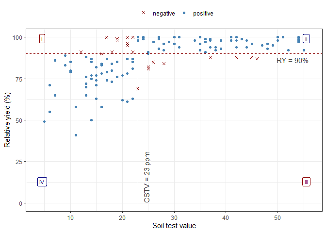
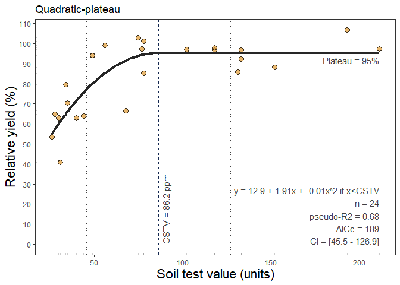
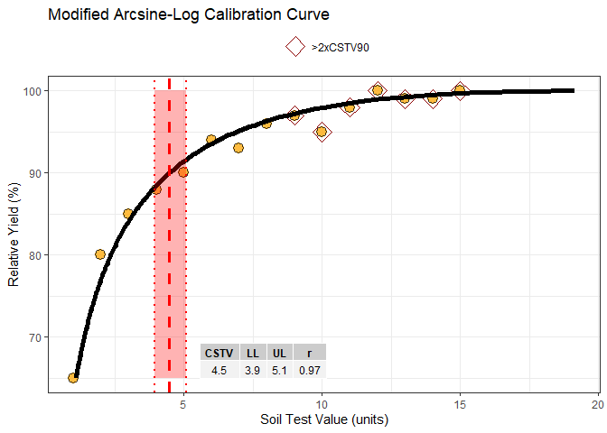
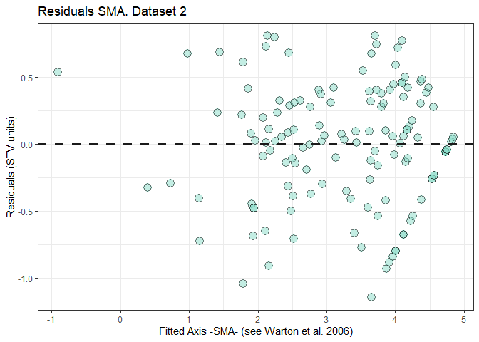

<!-- README.md is generated from README.Rmd. Please edit that file -->

# soiltestR: Soil Test Calibration in R

<!-- badges: start -->

[](https://ci.appveyor.com/project/adriancorrendo/soiltestR)
[](https://circleci.com/gh/adriancorrendo/soiltestR)
[](https://app.codecov.io/gh/adriancorrendo/modalcc?branch=main)
[](https://github.com/adriancorrendo/soiltestR/actions)
<!-- badges: end -->

The goal of `soiltestR` is to assist users on the analysis of
relationships between relative yield (RY) and soil test values (STV)
following different approaches. <br/>

The first calibration method available is the Modified Arcsine-log
Calibration Curve originally described by Dyson and Conyers (2013) and
modified by Correndo et al. (2017). <br/>


For its implementation, soiltestR presents the function `modALCC()` that
produces the estimation of critical soil test values (CSTV) for a target
relative yield (RY) with confidence intervals at adjustable confidence
levels. <br/>

`soiltestR` also allows users to implement the quadrants analysis
approach, also known as the Cate-Nelson analysis. There are two versions
of the Cate-Nelson technique: <br/>

(i). `cate.nelson.1965()`, based on Cate and Nelson (1965). The first
step of this method is to apply an arbitrarily fixed value of RY as a
target (y-axis) that divides the data into two categories (below & equal
or above RY target). In a second stage, it estimates the CSTV (x-axis)
as the minimum STV that divides the data into four quadrants (target RY
level combined with STV lower or greater than the CSTV) maximizing the
number of points under well-classified quadrants (II, STV \>= CSTV & RY
\>= RY target; and IV, STV \< CSTV & RY \< RY target). This is also
known as the “graphical” version of the Cate-Nelson approach. <br/>

(ii). `cate.nelson.1971()`, based on Cate and Nelson (1971). The first
step of this alternative version is to estimates the CSTV (x-axis) as
the minimum STV that minimizes the residual sum of squares when dividing
data points in two classes (lower or greater than the CSTV) without
using a fixed RY. This refined version does not constrains the model
performance (measured with the coefficient of determination -R2-) but
the user has no control on the RY level for the CSTV. This is also known
as the “statistical” version of the Cate-Nelson approach. <br/>

## 1. Installation

You can install the development version of modalcc from
[GitHub](https://github.com/adriancorrendo/modalcc) with:

``` r
# install.packages("devtools")
devtools::install_github("adriancorrendo/modalcc")
```

## 2. Example

This is a basic example which shows you how to use the package:

``` r
library(soiltestR)

# Other suggested packages
# Install if needed 
# install.packages("easypackages")
# install.packages("devtools")
library(easypackages) # Helps to load packages and install & load them if they are not installed yet.
library(devtools)
packages("readxl") # Open xlsx files
packages("tidyverse", "ggpmisc") # Data wrangling and plots
packages("smatr") # SMA regression analysis for reference

## basic example code
```

<b> Instructions for users </b> <br/>

1.  Load your dataframe with soil test value (STV) and relative yield
    (RY) data. <br/>

2.  Specify the following arguments into the function -modALCC()-: <br/>

(i). `data` (optional), <br/>

(ii). soil test value `STV` and relative yield `RY`, <br/>

(iii). `target` of relative yield (e.g. 90%), <br/>

(iv). desired `confidence` level (e.g. 0.95 for 1 - alpha(0.05)). Used
for the estimation of critical soil test value (CSTV) lower and upper
limits. <br/>

3.  Run and check results in a data.frame. <br/>

4.  Check residuals plot, and warnings related to potential leverage
    points. <br/>

5.  Adjust curve plots as desired. <br/>

### 2.1. Load a dataset

``` r
# Example 1 dataset
# Fake dataset manually created
data_1 = data.frame("RY" = c(65,80,85,88,90,94,93,96,97,95,98,100,99,99,100),
                   "STV" = c(1,2,3,4,5,6,7,8,9,10,11,12,13,14,15))
  

# Example 2. Native dataset from modalcc package

data_2 = soiltestR::data_test


# Create nested structure as example of multiple datasets
data.all = bind_rows(data_1, data_2, .id = "id") %>% 
  tidyr::nest(data = c("STV", "RY"))
```

## 3. Fit examples

### 3.1. Fit ALCC models individually

``` r
# RY target = 90%, confidence level = 0.95, replace with your desired values

# Data 1
# Using dataframe
fit_example_1 = soiltestR::modALCC(data = data_1, RY = RY, STV = STV, target=90, confidence = 0.95)
#> Warning: 7 STV points exceeded two-times (2x) 
#>   the CSTV for 90% of RY. Risk of leverage. You may consider a sensitivity analysis by 
#>   removing extreme points, re-run the modALCC(), and check results.
# Alternative using the vectors
#fit_example_1 = ALCC(RY = data_1$RY,STV = data_1$STV, target=90,confidence = 0.95)

fit_example_1
#>    n         r target     CSTV       LL       UL confidence      p_value
#> 1 15 0.9682908     90 4.478476 3.947041 5.081463       0.95 3.296044e-09
#>     CSTV90 n.90x2  CSTV100 n.100
#> 1 4.478476      7 19.15054     0
#>                                                                                                                                                                                                                                                                                                                                                                                                                                                                                                                                                                                                                                                                                                                                                                                                                                                                                                                                                                                                                                                                                                                                                                                                                                                                                                                                                                                                                                                                                                                                                                                                                                                                                                                                                                                                                                                                                                                                                                                                                                                                                                                                                                                                                                                                                                                                                                                                                                                                                                                                                                                                                                                                                                                                                                                                                                                                                                                                                                                                                                                                                                                                                                                                                                                                                                                                                                                                                                                                                                                                                                                                                                                                                                                                                                                                                                                        Curve
#> 1 65.000000, 65.200000, 65.400000, 65.600000, 65.800000, 66.000000, 66.200000, 66.400000, 66.600000, 66.800000, 67.000000, 67.200000, 67.400000, 67.600000, 67.800000, 68.000000, 68.200000, 68.400000, 68.600000, 68.800000, 69.000000, 69.200000, 69.400000, 69.600000, 69.800000, 70.000000, 70.200000, 70.400000, 70.600000, 70.800000, 71.000000, 71.200000, 71.400000, 71.600000, 71.800000, 72.000000, 72.200000, 72.400000, 72.600000, 72.800000, 73.000000, 73.200000, 73.400000, 73.600000, 73.800000, 74.000000, 74.200000, 74.400000, 74.600000, 74.800000, 75.000000, 75.200000, 75.400000, 75.600000, 75.800000, 76.000000, 76.200000, 76.400000, 76.600000, 76.800000, 77.000000, 77.200000, 77.400000, 77.600000, 77.800000, 78.000000, 78.200000, 78.400000, 78.600000, 78.800000, 79.000000, 79.200000, 79.400000, 79.600000, 79.800000, 80.000000, 80.200000, 80.400000, 80.600000, 80.800000, 81.000000, 81.200000, 81.400000, 81.600000, 81.800000, 82.000000, 82.200000, 82.400000, 82.600000, 82.800000, 83.000000, 83.200000, 83.400000, 83.600000, 83.800000, 84.000000, 84.200000, 84.400000, 84.600000, 84.800000, 85.000000, 85.200000, 85.400000, 85.600000, 85.800000, 86.000000, 86.200000, 86.400000, 86.600000, 86.800000, 87.000000, 87.200000, 87.400000, 87.600000, 87.800000, 88.000000, 88.200000, 88.400000, 88.600000, 88.800000, 89.000000, 89.200000, 89.400000, 89.600000, 89.800000, 90.000000, 90.200000, 90.400000, 90.600000, 90.800000, 91.000000, 91.200000, 91.400000, 91.600000, 91.800000, 92.000000, 92.200000, 92.400000, 92.600000, 92.800000, 93.000000, 93.200000, 93.400000, 93.600000, 93.800000, 94.000000, 94.200000, 94.400000, 94.600000, 94.800000, 95.000000, 95.200000, 95.400000, 95.600000, 95.800000, 96.000000, 96.200000, 96.400000, 96.600000, 96.800000, 97.000000, 97.200000, 97.400000, 97.600000, 97.800000, 98.000000, 98.200000, 98.400000, 98.600000, 98.800000, 99.000000, 99.200000, 99.400000, 99.600000, 99.800000, 100.000000, 1.097927, 1.108379, 1.118944, 1.129625, 1.140423, 1.151339, 1.162376, 1.173535, 1.184817, 1.196225, 1.207760, 1.219425, 1.231221, 1.243150, 1.255214, 1.267415, 1.279755, 1.292236, 1.304860, 1.317630, 1.330548, 1.343616, 1.356836, 1.370210, 1.383742, 1.397433, 1.411286, 1.425303, 1.439488, 1.453842, 1.468369, 1.483071, 1.497951, 1.513012, 1.528257, 1.543689, 1.559311, 1.575127, 1.591138, 1.607350, 1.623765, 1.640386, 1.657217, 1.674262, 1.691525, 1.709008, 1.726717, 1.744655, 1.762826, 1.781234, 1.799883, 1.818779, 1.837924, 1.857325, 1.876985, 1.896910, 1.917103, 1.937572, 1.958319, 1.979352, 2.000675, 2.022293, 2.044214, 2.066441, 2.088983, 2.111844, 2.135031, 2.158551, 2.182410, 2.206616, 2.231175, 2.256095, 2.281384, 2.307048, 2.333097, 2.359537, 2.386379, 2.413629, 2.441298, 2.469395, 2.497929, 2.526910, 2.556347, 2.586252, 2.616636, 2.647508, 2.678882, 2.710768, 2.743179, 2.776127, 2.809626, 2.843690, 2.878331, 2.913565, 2.949407, 2.985872, 3.022976, 3.060736, 3.099169, 3.138294, 3.178128, 3.218691, 3.260004, 3.302086, 3.344960, 3.388649, 3.433176, 3.478564, 3.524841, 3.572032, 3.620165, 3.669269, 3.719374, 3.770512, 3.822716, 3.876020, 3.930460, 3.986075, 4.042904, 4.100988, 4.160372, 4.221100, 4.283223, 4.346790, 4.411856, 4.478476, 4.546710, 4.616622, 4.688278, 4.761749, 4.837110, 4.914440, 4.993823, 5.075351, 5.159117, 5.245225, 5.333784, 5.424910, 5.518728, 5.615374, 5.714992, 5.817737, 5.923779, 6.033299, 6.146495, 6.263582, 6.384794, 6.510388, 6.640644, 6.775870, 6.916408, 7.062634, 7.214969, 7.373879, 7.539891, 7.713596, 7.895664, 8.086860, 8.288063, 8.500287, 8.724716, 8.962742, 9.216022, 9.486552, 9.776766, 10.089688, 10.429142, 10.800084, 11.209119, 11.665380, 12.182103, 12.779738, 13.492946, 14.389790, 15.647308, 19.150544
#>                                                                                                                                                                                                                                                                                                                                                                                                                                                                                                                                                                                                                                                                                                                                                                                                                                                                                                                                             SMA
#> 1 0.00000000, 0.69314718, 1.09861229, 1.38629436, 1.60943791, 1.79175947, 1.94591015, 2.07944154, 2.19722458, 2.30258509, 2.39789527, 2.48490665, 2.56494936, 2.63905733, 2.70805020, -0.31130128, -0.14189705, -0.07594886, -0.03199105, 0.00000000, 0.07428349, 0.05398723, 0.12039263, 0.14766754, 0.09623715, 0.17985350, 0.32175055, 0.22158313, 0.22158313, 0.32175055, 0.09342397, 0.85846552, 1.15629226, 1.35480886, 1.49928272, 1.83475226, 1.74309289, 2.04298443, 2.16615987, 1.93389654, 2.31151393, 2.95233114, 2.49996793, 2.49996793, 2.95233114, -0.09342397, -0.16531834, -0.05767997, 0.03148550, 0.11015519, -0.04299279, 0.20281726, 0.03645711, 0.03106471, 0.36868855, 0.08638134, -0.46742449, 0.06498143, 0.13908940, -0.24428093, -1.40585875, 0.05232998, 0.75562183, 1.24182049, 1.60943791, 2.12722900, 2.18972031, 2.62314325, 2.86410172, 2.73719891, 3.21012648, 3.93795506, 3.56563456, 3.63974254, 4.16109861

# Data 2
fit_example_2 = soiltestR::modALCC(data = data_2, RY = RY, STV = STV, target=90, confidence = 0.95)
#> Warning: 9 STV points exceeded the CSTV for 100% of RY.
#>   Risk of leverage. You may consider a sensitivity analysis by removing extreme points, 
#>   re-run the modALCC(), and check results.
#> Warning: 22 STV points exceeded two-times (2x) 
#>   the CSTV for 90% of RY. Risk of leverage. You may consider a sensitivity analysis by 
#>   removing extreme points, re-run the modALCC(), and check results.

fit_example_2
#>     n         r target     CSTV       LL       UL confidence      p_value
#> 1 137 0.7164928     90 23.25457 21.57156 25.06888       0.95 7.314913e-23
#>     CSTV90 n.90x2  CSTV100 n.100
#> 1 23.25457     22 53.10299     9
#>                                                                                                                                                                                                                                                                                                                                                                                                                                                                                                                                                                                                                                                                                                                                                                                                                                                                                                                                                                                                                                                                                                                                                                                                                                                                                                                                                                                                                                                                                                                                                                                                                                                                                                                                                                                                                                                                                                                                                                                                                                                                                                                                                                                                                                                                                                                                                                                                                                                                                                                                                                                                                                                                                                                                                                                                                                                                                                                                                                                                                                                                                                                                                                                                                                                                                                                                                                                                                                                                                                                                                                                                                                                                                                                                                                                                                                                                                                                                                                                                                                                                                                                                                                                                                                                                                                                                                                                                                                                                                                                                                                                                                                                                                                                                                                                                                                                                                                                                                                                                                                                                                                                                                                                                                                                                                                                                                                                                                                                                                                                                                                                                                                                                                                                                                                                                                                                                                                                                                                                                                                                                                                                                                                                                                                                                                                                                                                                                                                                                                                                                                                                                                                                                                                                                                                                                                                                                                                                                                                                                                                                                                                                                                                                                                                                                                                                                                                                                                                                                                                                                                                                                                                                                                                                                                                                                                                                                                                                                                                                                                                                                                                                                                                                                                                                                                                                                                                                                                                                                                                                                                                                                                                                                                                                                                                                                                                                                                                                                                                                                                                                                                                                                                                                                                                                                                                                                                                                                                                                                                                                                                                                                                                                                                                                                                                                                                                  Curve
#> 1 12.000000, 12.200000, 12.400000, 12.600000, 12.800000, 13.000000, 13.200000, 13.400000, 13.600000, 13.800000, 14.000000, 14.200000, 14.400000, 14.600000, 14.800000, 15.000000, 15.200000, 15.400000, 15.600000, 15.800000, 16.000000, 16.200000, 16.400000, 16.600000, 16.800000, 17.000000, 17.200000, 17.400000, 17.600000, 17.800000, 18.000000, 18.200000, 18.400000, 18.600000, 18.800000, 19.000000, 19.200000, 19.400000, 19.600000, 19.800000, 20.000000, 20.200000, 20.400000, 20.600000, 20.800000, 21.000000, 21.200000, 21.400000, 21.600000, 21.800000, 22.000000, 22.200000, 22.400000, 22.600000, 22.800000, 23.000000, 23.200000, 23.400000, 23.600000, 23.800000, 24.000000, 24.200000, 24.400000, 24.600000, 24.800000, 25.000000, 25.200000, 25.400000, 25.600000, 25.800000, 26.000000, 26.200000, 26.400000, 26.600000, 26.800000, 27.000000, 27.200000, 27.400000, 27.600000, 27.800000, 28.000000, 28.200000, 28.400000, 28.600000, 28.800000, 29.000000, 29.200000, 29.400000, 29.600000, 29.800000, 30.000000, 30.200000, 30.400000, 30.600000, 30.800000, 31.000000, 31.200000, 31.400000, 31.600000, 31.800000, 32.000000, 32.200000, 32.400000, 32.600000, 32.800000, 33.000000, 33.200000, 33.400000, 33.600000, 33.800000, 34.000000, 34.200000, 34.400000, 34.600000, 34.800000, 35.000000, 35.200000, 35.400000, 35.600000, 35.800000, 36.000000, 36.200000, 36.400000, 36.600000, 36.800000, 37.000000, 37.200000, 37.400000, 37.600000, 37.800000, 38.000000, 38.200000, 38.400000, 38.600000, 38.800000, 39.000000, 39.200000, 39.400000, 39.600000, 39.800000, 40.000000, 40.200000, 40.400000, 40.600000, 40.800000, 41.000000, 41.200000, 41.400000, 41.600000, 41.800000, 42.000000, 42.200000, 42.400000, 42.600000, 42.800000, 43.000000, 43.200000, 43.400000, 43.600000, 43.800000, 44.000000, 44.200000, 44.400000, 44.600000, 44.800000, 45.000000, 45.200000, 45.400000, 45.600000, 45.800000, 46.000000, 46.200000, 46.400000, 46.600000, 46.800000, 47.000000, 47.200000, 47.400000, 47.600000, 47.800000, 48.000000, 48.200000, 48.400000, 48.600000, 48.800000, 49.000000, 49.200000, 49.400000, 49.600000, 49.800000, 50.000000, 50.200000, 50.400000, 50.600000, 50.800000, 51.000000, 51.200000, 51.400000, 51.600000, 51.800000, 52.000000, 52.200000, 52.400000, 52.600000, 52.800000, 53.000000, 53.200000, 53.400000, 53.600000, 53.800000, 54.000000, 54.200000, 54.400000, 54.600000, 54.800000, 55.000000, 55.200000, 55.400000, 55.600000, 55.800000, 56.000000, 56.200000, 56.400000, 56.600000, 56.800000, 57.000000, 57.200000, 57.400000, 57.600000, 57.800000, 58.000000, 58.200000, 58.400000, 58.600000, 58.800000, 59.000000, 59.200000, 59.400000, 59.600000, 59.800000, 60.000000, 60.200000, 60.400000, 60.600000, 60.800000, 61.000000, 61.200000, 61.400000, 61.600000, 61.800000, 62.000000, 62.200000, 62.400000, 62.600000, 62.800000, 63.000000, 63.200000, 63.400000, 63.600000, 63.800000, 64.000000, 64.200000, 64.400000, 64.600000, 64.800000, 65.000000, 65.200000, 65.400000, 65.600000, 65.800000, 66.000000, 66.200000, 66.400000, 66.600000, 66.800000, 67.000000, 67.200000, 67.400000, 67.600000, 67.800000, 68.000000, 68.200000, 68.400000, 68.600000, 68.800000, 69.000000, 69.200000, 69.400000, 69.600000, 69.800000, 70.000000, 70.200000, 70.400000, 70.600000, 70.800000, 71.000000, 71.200000, 71.400000, 71.600000, 71.800000, 72.000000, 72.200000, 72.400000, 72.600000, 72.800000, 73.000000, 73.200000, 73.400000, 73.600000, 73.800000, 74.000000, 74.200000, 74.400000, 74.600000, 74.800000, 75.000000, 75.200000, 75.400000, 75.600000, 75.800000, 76.000000, 76.200000, 76.400000, 76.600000, 76.800000, 77.000000, 77.200000, 77.400000, 77.600000, 77.800000, 78.000000, 78.200000, 78.400000, 78.600000, 78.800000, 79.000000, 79.200000, 79.400000, 79.600000, 79.800000, 80.000000, 80.200000, 80.400000, 80.600000, 80.800000, 81.000000, 81.200000, 81.400000, 81.600000, 81.800000, 82.000000, 82.200000, 82.400000, 82.600000, 82.800000, 83.000000, 83.200000, 83.400000, 83.600000, 83.800000, 84.000000, 84.200000, 84.400000, 84.600000, 84.800000, 85.000000, 85.200000, 85.400000, 85.600000, 85.800000, 86.000000, 86.200000, 86.400000, 86.600000, 86.800000, 87.000000, 87.200000, 87.400000, 87.600000, 87.800000, 88.000000, 88.200000, 88.400000, 88.600000, 88.800000, 89.000000, 89.200000, 89.400000, 89.600000, 89.800000, 90.000000, 90.200000, 90.400000, 90.600000, 90.800000, 91.000000, 91.200000, 91.400000, 91.600000, 91.800000, 92.000000, 92.200000, 92.400000, 92.600000, 92.800000, 93.000000, 93.200000, 93.400000, 93.600000, 93.800000, 94.000000, 94.200000, 94.400000, 94.600000, 94.800000, 95.000000, 95.200000, 95.400000, 95.600000, 95.800000, 96.000000, 96.200000, 96.400000, 96.600000, 96.800000, 97.000000, 97.200000, 97.400000, 97.600000, 97.800000, 98.000000, 98.200000, 98.400000, 98.600000, 98.800000, 99.000000, 99.200000, 99.400000, 99.600000, 99.800000, 100.000000, 2.336883, 2.355345, 2.373822, 2.392314, 2.410824, 2.429353, 2.447902, 2.466472, 2.485066, 2.503683, 2.522326, 2.540994, 2.559691, 2.578416, 2.597171, 2.615957, 2.634775, 2.653625, 2.672510, 2.691430, 2.710385, 2.729377, 2.748407, 2.767476, 2.786584, 2.805733, 2.824922, 2.844155, 2.863430, 2.882748, 2.902112, 2.921521, 2.940976, 2.960478, 2.980028, 2.999627, 3.019275, 3.038973, 3.058722, 3.078522, 3.098374, 3.118280, 3.138239, 3.158253, 3.178322, 3.198446, 3.218628, 3.238866, 3.259162, 3.279517, 3.299931, 3.320405, 3.340940, 3.361536, 3.382194, 3.402915, 3.423698, 3.444546, 3.465459, 3.486436, 3.507480, 3.528590, 3.549767, 3.571012, 3.592326, 3.613709, 3.635161, 3.656685, 3.678279, 3.699945, 3.721683, 3.743495, 3.765380, 3.787340, 3.809375, 3.831485, 3.853672, 3.875936, 3.898277, 3.920697, 3.943195, 3.965774, 3.988432, 4.011172, 4.033993, 4.056896, 4.079883, 4.102953, 4.126107, 4.149347, 4.172672, 4.196083, 4.219582, 4.243168, 4.266843, 4.290606, 4.314460, 4.338404, 4.362439, 4.386567, 4.410787, 4.435100, 4.459507, 4.484009, 4.508607, 4.533301, 4.558092, 4.582980, 4.607967, 4.633054, 4.658240, 4.683527, 4.708916, 4.734406, 4.760000, 4.785698, 4.811500, 4.837408, 4.863422, 4.889542, 4.915771, 4.942108, 4.968555, 4.995111, 5.021779, 5.048559, 5.075451, 5.102457, 5.129578, 5.156813, 5.184165, 5.211634, 5.239220, 5.266926, 5.294751, 5.322696, 5.350763, 5.378953, 5.407266, 5.435703, 5.464265, 5.492953, 5.521768, 5.550712, 5.579784, 5.608986, 5.638319, 5.667784, 5.697382, 5.727114, 5.756981, 5.786984, 5.817124, 5.847402, 5.877819, 5.908377, 5.939075, 5.969916, 6.000901, 6.032030, 6.063304, 6.094726, 6.126295, 6.158014, 6.189883, 6.221903, 6.254076, 6.286402, 6.318884, 6.351522, 6.384317, 6.417271, 6.450385, 6.483660, 6.517098, 6.550699, 6.584466, 6.618399, 6.652499, 6.686769, 6.721209, 6.755821, 6.790607, 6.825566, 6.860702, 6.896016, 6.931508, 6.967181, 7.003035, 7.039073, 7.075296, 7.111705, 7.148302, 7.185089, 7.222066, 7.259237, 7.296601, 7.334162, 7.371920, 7.409878, 7.448036, 7.486397, 7.524963, 7.563734, 7.602714, 7.641903, 7.681304, 7.720918, 7.760747, 7.800794, 7.841059, 7.881546, 7.922255, 7.963189, 8.004350, 8.045739, 8.087360, 8.129213, 8.171302, 8.213628, 8.256193, 8.298999, 8.342049, 8.385345, 8.428890, 8.472684, 8.516732, 8.561034, 8.605594, 8.650414, 8.695497, 8.740844, 8.786458, 8.832342, 8.878499, 8.924930, 8.971640, 9.018629, 9.065902, 9.113461, 9.161308, 9.209446, 9.257879, 9.306609, 9.355639, 9.404972, 9.454611, 9.504560, 9.554821, 9.605397, 9.656292, 9.707509, 9.759051, 9.810922, 9.863125, 9.915663, 9.968541, 10.021761, 10.075327, 10.129242, 10.183511, 10.238138, 10.293126, 10.348478, 10.404200, 10.460295, 10.516766, 10.573619, 10.630857, 10.688485, 10.746507, 10.804928, 10.863751, 10.922982, 10.982625, 11.042685, 11.103166, 11.164074, 11.225413, 11.287189, 11.349407, 11.412071, 11.475188, 11.538762, 11.602799, 11.667304, 11.732284, 11.797744, 11.863690, 11.930128, 11.997064, 12.064504, 12.132455, 12.200922, 12.269914, 12.339435, 12.409494, 12.480096, 12.551250, 12.622962, 12.695240, 12.768091, 12.841522, 12.915543, 12.990159, 13.065381, 13.141215, 13.217670, 13.294756, 13.372480, 13.450851, 13.529880, 13.609574, 13.689945, 13.771001, 13.852752, 13.935209, 14.018381, 14.102280, 14.186917, 14.272302, 14.358448, 14.445364, 14.533064, 14.621560, 14.710863, 14.800987, 14.891945, 14.983749, 15.076415, 15.169955, 15.264384, 15.359717, 15.455968, 15.553154, 15.651289, 15.750391, 15.850475, 15.951559, 16.053661, 16.156798, 16.260989, 16.366253, 16.472609, 16.580077, 16.688679, 16.798434, 16.909365, 17.021495, 17.134845, 17.249441, 17.365306, 17.482466, 17.600946, 17.720773, 17.841975, 17.964580, 18.088618, 18.214118, 18.341112, 18.469631, 18.599711, 18.731384, 18.864686, 18.999655, 19.136328, 19.274745, 19.414946, 19.556974, 19.700873, 19.846689, 19.994468, 20.144260, 20.296115, 20.450087, 20.606231, 20.764604, 20.925266, 21.088278, 21.253707, 21.421618, 21.592084, 21.765177, 21.940974, 22.119557, 22.301010, 22.485420, 22.672882, 22.863491, 23.057350, 23.254567, 23.455255, 23.659532, 23.867524, 24.079364, 24.295192, 24.515156, 24.739412, 24.968128, 25.201479, 25.439655, 25.682855, 25.931293, 26.185196, 26.444810, 26.710396, 26.982235, 27.260631, 27.545908, 27.838422, 28.138553, 28.446718, 28.763369, 29.089000, 29.424154, 29.769426, 30.125473, 30.493024, 30.872890, 31.265974, 31.673293, 32.095997, 32.535388, 32.992958, 33.470424, 33.969784, 34.493376, 35.043972, 35.624899, 36.240199, 36.894871, 37.595217, 38.349366, 39.168111, 40.066313, 41.065417, 42.198418, 43.520998, 45.142004, 47.343203, 53.102988
#>                                                                                                                                                                                                                                                                                                                                                                                                                                                                                                                                                                                                                                                                                                                                                                                                                                                                                                                                                                                                                                                                                                                                                                                                                                                                                                                                                                                                                                                                                                                                                                                                                                                                                                                                                                                                                                                                                                                                                                                                                                                                                                                                                                                                                                                                                                                                                                                                                                                                                                                                                                                                                                                                                                                                                                                                                                                                                                                                                                                                                                                                                                                                                                                                                                                                                                                                                                                                                                                                                                                                                                                                                                                                                                                                                                                                                                                                                                                                                                                                                                                                                                                                                                                                                                                                                                                                                                                                                                                                                                                                                                                                                                                                                                                                                                                                                                                                                                                                                                                                                                                                                                                                                                                                                                                                                                                                                                                                                                                                                                                                                                                                                                                                                                                                                                                                                                                                                                                                                                                                                                                                                                                                                                                                                                                                                                                                                                                                                                                                                                                                                                                                                                                                                                                                                                                                                                                                                                                                                                                                                                                                                                                                                                                                                                                                                                                                                                                                                                                                                                                                                                                                                                                                                                                                                                                                                                                                                                                                                                                                                                                                                                                                                                                                                                                                                                                                                                                                                                                                                                                                                                                                                                                                                                                                                                                                                                                                                                                                                                                                                                                                                                                                                                                                                                                                                                                                                                                                SMA
#> 1 1.386294361, 1.609437912, 1.791759469, 1.791759469, 1.945910149, 1.945910149, 2.197224577, 2.197224577, 2.302585093, 2.302585093, 2.302585093, 2.302585093, 2.397895273, 2.397895273, 2.484906650, 2.564949357, 2.564949357, 2.564949357, 2.564949357, 2.564949357, 2.639057330, 2.639057330, 2.639057330, 2.639057330, 2.639057330, 2.708050201, 2.708050201, 2.708050201, 2.708050201, 2.708050201, 2.772588722, 2.772588722, 2.772588722, 2.772588722, 2.772588722, 2.833213344, 2.833213344, 2.833213344, 2.833213344, 2.890371758, 2.890371758, 2.890371758, 2.890371758, 2.944438979, 2.944438979, 2.944438979, 2.944438979, 2.995732274, 2.995732274, 3.044522438, 3.044522438, 3.044522438, 3.044522438, 3.044522438, 3.044522438, 3.091042453, 3.091042453, 3.091042453, 3.091042453, 3.091042453, 3.091042453, 3.135494216, 3.135494216, 3.135494216, 3.178053830, 3.178053830, 3.178053830, 3.218875825, 3.218875825, 3.218875825, 3.218875825, 3.258096538, 3.258096538, 3.295836866, 3.295836866, 3.295836866, 3.295836866, 3.332204510, 3.332204510, 3.332204510, 3.367295830, 3.401197382, 3.401197382, 3.433987204, 3.433987204, 3.526360525, 3.555348061, 3.555348061, 3.555348061, 3.583518938, 3.583518938, 3.583518938, 3.610917913, 3.610917913, 3.610917913, 3.610917913, 3.637586160, 3.637586160, 3.663561646, 3.663561646, 3.713572067, 3.713572067, 3.713572067, 3.713572067, 3.737669618, 3.737669618, 3.737669618, 3.737669618, 3.737669618, 3.761200116, 3.784189634, 3.784189634, 3.806662490, 3.806662490, 3.828641396, 3.850147602, 3.850147602, 3.871201011, 3.871201011, 3.891820298, 3.912023005, 3.912023005, 3.912023005, 3.912023005, 3.912023005, 3.931825633, 3.931825633, 3.951243719, 3.988984047, 3.988984047, 3.988984047, 3.988984047, 4.007333185, 4.007333185, 4.007333185, 4.025351691, 4.025351691, -0.895304167, -0.473648276, -0.246924949, -0.413563898, -0.061746450, -0.311301282, -0.016314700, -0.103238229, -0.154283264, -0.141897055, -0.141897055, -0.075948861, -0.383302283, -0.554140835, 0.017057900, -0.257889186, -0.235848272, -0.190222134, -0.311301282, -0.031991051, -0.047112430, -0.463647609, -0.178429054, -0.201848221, -0.075948861, -0.332136508, -0.116398476, -0.246924949, -0.213320253, -0.178429054, -0.103238229, 0.000000000, -0.089766292, -0.383302283, -0.166454709, 0.321750554, -0.213320253, -0.047112430, -0.154283264, -0.141897055, 0.017057900, -0.089766292, -0.224650010, 0.221583133, -0.075948861, -0.190222134, 0.179853500, -0.178429054, -0.342464683, 0.120392634, -0.166454709, 0.096237148, -0.352740374, -0.047112430, 0.321750554, -0.075948861, -0.129276257, -0.047112430, -0.332136508, 0.017057900, 0.321750554, 0.179853500, -0.268749461, 0.321750554, 0.321750554, 0.221583133, 0.321750554, -0.116398476, 0.000000000, 0.017057900, -0.129276257, -0.075948861, 0.147667544, 0.321750554, 0.321750554, 0.221583133, 0.053987227, 0.120392634, 0.034994002, -0.089766292, 0.147667544, 0.321750554, 0.120392634, 0.321750554, 0.074283491, 0.179853500, 0.321750554, 0.034994002, 0.120392634, 0.221583133, 0.147667544, 0.017057900, 0.221583133, 0.074283491, 0.179853500, -0.031991051, 0.074283491, 0.034994002, 0.179853500, 0.053987227, 0.179853500, 0.321750554, 0.321750554, 0.179853500, 0.321750554, 0.179853500, -0.031991051, 0.321750554, 0.074283491, 0.221583133, 0.179853500, 0.074283491, -0.031991051, 0.120392634, -0.047112430, 0.096237148, 0.096237148, 0.120392634, 0.053987227, 0.096237148, 0.321750554, 0.321750554, 0.321750554, 0.179853500, 0.321750554, 0.321750554, 0.321750554, 0.034994002, 0.321750554, 0.147667544, 0.221583133, 0.179853500, 0.321750554, 0.147667544, 0.034994002, 0.321750554, 0.179853500, 0.848817889, 1.930943814, 2.512800241, 2.085142686, 2.988037180, 2.347586614, 3.104631955, 2.881553835, 2.750553280, 2.782340901, 2.782340901, 2.951588508, 2.162805253, 1.724369955, 3.190278467, 2.484661929, 2.541227115, 2.658320765, 2.347586614, 3.064400604, 3.025593520, 1.956609247, 2.688586196, 2.628483898, 2.951588508, 2.294115672, 2.847779742, 2.512800241, 2.599042396, 2.688586196, 2.881553835, 3.146501547, 2.916127838, 2.162805253, 2.719316822, 3.972233202, 2.599042396, 3.025593520, 2.750553280, 2.782340901, 3.190278467, 2.916127838, 2.569966024, 3.715166324, 2.951588508, 2.658320765, 3.608072556, 2.688586196, 2.267609729, 3.455473846, 2.719316822, 3.393481883, 2.241238484, 3.025593520, 3.972233202, 2.951588508, 2.814730564, 3.025593520, 2.294115672, 3.190278467, 3.972233202, 3.608072556, 2.456790422, 3.972233202, 3.972233202, 3.715166324, 3.972233202, 2.847779742, 3.146501547, 3.190278467, 2.814730564, 2.951588508, 3.525471415, 3.972233202, 3.972233202, 3.715166324, 3.285052862, 3.455473846, 3.236309179, 2.916127838, 3.525471415, 3.972233202, 3.455473846, 3.972233202, 3.337140628, 3.608072556, 3.972233202, 3.236309179, 3.455473846, 3.715166324, 3.525471415, 3.190278467, 3.715166324, 3.337140628, 3.608072556, 3.064400604, 3.337140628, 3.236309179, 3.608072556, 3.285052862, 3.608072556, 3.972233202, 3.972233202, 3.608072556, 3.972233202, 3.608072556, 3.064400604, 3.972233202, 3.337140628, 3.715166324, 3.608072556, 3.337140628, 3.064400604, 3.455473846, 3.025593520, 3.393481883, 3.393481883, 3.455473846, 3.285052862, 3.393481883, 3.972233202, 3.972233202, 3.972233202, 3.608072556, 3.972233202, 3.972233202, 3.972233202, 3.236309179, 3.972233202, 3.525471415, 3.715166324, 3.608072556, 3.972233202, 3.525471415, 3.236309179, 3.972233202, 3.608072556, 0.537476472, -0.321505902, -0.721040772, -0.293383216, -1.042127031, -0.401676465, -0.907407377, -0.684329258, -0.447968187, -0.479755808, -0.479755808, -0.649003415, 0.235090020, 0.673525318, -0.705371817, 0.080287429, 0.023722242, -0.093371408, 0.217362743, -0.499451247, -0.386536191, 0.682448083, -0.049528866, 0.010573431, -0.312531178, 0.413934529, -0.139729541, 0.195249960, 0.109007805, 0.019464006, -0.108965113, -0.373912825, -0.143539116, 0.609783469, 0.053271901, -1.139019858, 0.234170948, -0.192380176, 0.082660064, 0.108030857, -0.299906709, -0.025756080, 0.320405734, -0.770727345, -0.007149529, 0.286118214, -0.663633577, 0.307146078, 0.728122544, -0.410951409, 0.325205616, -0.348959445, 0.803283954, 0.018928917, -0.927710764, 0.139453945, 0.276311890, 0.065448933, 0.796926781, -0.099236014, -0.881190748, -0.472578340, 0.678703794, -0.836738986, -0.794179371, -0.537112494, -0.794179371, 0.371096083, 0.072374278, 0.028597358, 0.404145261, 0.306508030, -0.267374877, -0.676396336, -0.676396336, -0.419329458, 0.010784004, -0.123269336, 0.095895331, 0.416076672, -0.158175585, -0.571035820, -0.054276465, -0.538245997, 0.096846576, -0.081712031, -0.416885140, 0.319038883, 0.099874215, -0.131647386, 0.058047523, 0.393240471, -0.104248411, 0.273777284, 0.002845357, 0.546517308, 0.300445531, 0.401276981, 0.055489090, 0.378508784, 0.105499511, -0.258661135, -0.258661135, 0.105499511, -0.234563583, 0.129597062, 0.673269014, -0.234563583, 0.400528990, 0.046033792, 0.176117078, 0.447049005, 0.742261885, 0.351188644, 0.803047876, 0.456665719, 0.456665719, 0.415727165, 0.586148149, 0.498338416, -0.060210196, -0.060210196, -0.060210196, 0.303950450, -0.060210196, -0.040407569, -0.040407569, 0.714934540, 0.016750845, 0.463512631, 0.273817723, 0.380911491, 0.035099984, 0.481861770, 0.771024006, 0.053118489, 0.417279135, -0.911389297, 0.393880180, 1.158058163, 0.730400608, 1.787445782, 1.146995216, 2.155354985, 1.932276865, 1.906636826, 1.938424447, 1.938424447, 2.107672054, 1.414198979, 0.975763681, 2.528683570, 1.903109739, 1.959674925, 2.076768576, 1.766034424, 2.482848415, 2.518149303, 1.449165029, 2.181141978, 2.121039681, 2.444144290, 1.855664326, 2.409328396, 2.074348895, 2.160591050, 2.250134850, 2.507641010, 2.772588722, 2.542215013, 1.788892428, 2.345403997, 3.658944999, 2.285754193, 2.712305317, 2.437265077, 2.526211112, 2.934148678, 2.659998049, 2.313836235, 3.513103756, 2.749525940, 2.456258197, 3.406009988, 2.537816922, 2.116840456, 3.353494737, 2.617337712, 3.291502773, 2.139259375, 2.923614411, 3.870254092, 2.896129414, 2.759271470, 2.970134427, 2.238656578, 3.134819373, 3.916774108, 3.597065225, 2.445783091, 3.961225870, 4.003785485, 3.746718607, 4.003785485, 2.920154020, 3.218875825, 3.262652745, 2.887104841, 3.063183499, 3.637066406, 4.121568521, 4.121568521, 3.864501643, 3.434388181, 3.641176809, 3.422012142, 3.101830801, 3.746265698, 4.226929036, 3.710169681, 4.259718859, 3.624626286, 3.987931533, 4.381079716, 3.645155693, 3.864320361, 4.152183715, 3.962488807, 3.627295859, 4.179582690, 3.801556994, 4.072488921, 3.528816970, 3.828225241, 3.727393792, 4.125132655, 3.802112961, 4.175143075, 4.539303721, 4.539303721, 4.175143075, 4.563401273, 4.199240627, 3.655568675, 4.563401273, 3.928308700, 4.329864893, 4.245760643, 3.974828715, 3.724561547, 4.115634789, 3.707733370, 4.097127937, 4.097127937, 4.180173310, 4.009752326, 4.138800634, 4.737754660, 4.737754660, 4.737754660, 4.373594014, 4.737754660, 4.757557287, 4.757557287, 4.041051350, 4.814715701, 4.367953915, 4.557648823, 4.450555055, 4.833064840, 4.386303054, 4.097140817, 4.851083345, 4.486922699
```

### 2.3. Fit multiple ALCC models with mapping

``` r
# Run multiple examples at once with map()
fit_examples = data.all %>%
  mutate(modALCC = map(data, ~ soiltestR::modALCC(RY = .$RY, STV = .$STV, target=90, confidence = 0.95))) %>% 
  unnest(., cols = c("modALCC"))
#> Warning: 7 STV points exceeded two-times (2x) 
#>   the CSTV for 90% of RY. Risk of leverage. You may consider a sensitivity analysis by 
#>   removing extreme points, re-run the modALCC(), and check results.
#> Warning: 9 STV points exceeded the CSTV for 100% of RY.
#>   Risk of leverage. You may consider a sensitivity analysis by removing extreme points, 
#>   re-run the modALCC(), and check results.
#> Warning: 22 STV points exceeded two-times (2x) 
#>   the CSTV for 90% of RY. Risk of leverage. You may consider a sensitivity analysis by 
#>   removing extreme points, re-run the modALCC(), and check results.

head(fit_examples)
#> # A tibble: 2 x 16
#>   id    data         n     r target  CSTV    LL    UL confidence  p_value CSTV90
#>   <chr> <list>   <int> <dbl>  <dbl> <dbl> <dbl> <dbl>      <dbl>    <dbl>  <dbl>
#> 1 1     <tibble>    15 0.968     90  4.48  3.95  5.08       0.95 3.30e- 9   4.48
#> 2 2     <tibble>   137 0.716     90 23.3  21.6  25.1        0.95 7.31e-23  23.3 
#> # ... with 5 more variables: n.90x2 <int>, CSTV100 <dbl>, n.100 <int>,
#> #   Curve <list>, SMA <list>

# Alternative with group_map, this does not required nested data.
fit_all = bind_rows(data_1, data_2, .id = "id") %>% 
  group_by(id) %>% 
  group_map(~ soiltestR::modALCC(data = ., RY = RY, STV = STV, target = 90, confidence = 0.95))
#> Warning: 7 STV points exceeded two-times (2x) 
#>   the CSTV for 90% of RY. Risk of leverage. You may consider a sensitivity analysis by 
#>   removing extreme points, re-run the modALCC(), and check results.
#> Warning: 9 STV points exceeded the CSTV for 100% of RY.
#>   Risk of leverage. You may consider a sensitivity analysis by removing extreme points, 
#>   re-run the modALCC(), and check results.
#> Warning: 22 STV points exceeded two-times (2x) 
#>   the CSTV for 90% of RY. Risk of leverage. You may consider a sensitivity analysis by 
#>   removing extreme points, re-run the modALCC(), and check results.

head(fit_all)
#> [[1]]
#>    n         r target     CSTV       LL       UL confidence      p_value
#> 1 15 0.9682908     90 4.478476 3.947041 5.081463       0.95 3.296044e-09
#>     CSTV90 n.90x2  CSTV100 n.100
#> 1 4.478476      7 19.15054     0
#>                                                                                                                                                                                                                                                                                                                                                                                                                                                                                                                                                                                                                                                                                                                                                                                                                                                                                                                                                                                                                                                                                                                                                                                                                                                                                                                                                                                                                                                                                                                                                                                                                                                                                                                                                                                                                                                                                                                                                                                                                                                                                                                                                                                                                                                                                                                                                                                                                                                                                                                                                                                                                                                                                                                                                                                                                                                                                                                                                                                                                                                                                                                                                                                                                                                                                                                                                                                                                                                                                                                                                                                                                                                                                                                                                                                                                                                        Curve
#> 1 65.000000, 65.200000, 65.400000, 65.600000, 65.800000, 66.000000, 66.200000, 66.400000, 66.600000, 66.800000, 67.000000, 67.200000, 67.400000, 67.600000, 67.800000, 68.000000, 68.200000, 68.400000, 68.600000, 68.800000, 69.000000, 69.200000, 69.400000, 69.600000, 69.800000, 70.000000, 70.200000, 70.400000, 70.600000, 70.800000, 71.000000, 71.200000, 71.400000, 71.600000, 71.800000, 72.000000, 72.200000, 72.400000, 72.600000, 72.800000, 73.000000, 73.200000, 73.400000, 73.600000, 73.800000, 74.000000, 74.200000, 74.400000, 74.600000, 74.800000, 75.000000, 75.200000, 75.400000, 75.600000, 75.800000, 76.000000, 76.200000, 76.400000, 76.600000, 76.800000, 77.000000, 77.200000, 77.400000, 77.600000, 77.800000, 78.000000, 78.200000, 78.400000, 78.600000, 78.800000, 79.000000, 79.200000, 79.400000, 79.600000, 79.800000, 80.000000, 80.200000, 80.400000, 80.600000, 80.800000, 81.000000, 81.200000, 81.400000, 81.600000, 81.800000, 82.000000, 82.200000, 82.400000, 82.600000, 82.800000, 83.000000, 83.200000, 83.400000, 83.600000, 83.800000, 84.000000, 84.200000, 84.400000, 84.600000, 84.800000, 85.000000, 85.200000, 85.400000, 85.600000, 85.800000, 86.000000, 86.200000, 86.400000, 86.600000, 86.800000, 87.000000, 87.200000, 87.400000, 87.600000, 87.800000, 88.000000, 88.200000, 88.400000, 88.600000, 88.800000, 89.000000, 89.200000, 89.400000, 89.600000, 89.800000, 90.000000, 90.200000, 90.400000, 90.600000, 90.800000, 91.000000, 91.200000, 91.400000, 91.600000, 91.800000, 92.000000, 92.200000, 92.400000, 92.600000, 92.800000, 93.000000, 93.200000, 93.400000, 93.600000, 93.800000, 94.000000, 94.200000, 94.400000, 94.600000, 94.800000, 95.000000, 95.200000, 95.400000, 95.600000, 95.800000, 96.000000, 96.200000, 96.400000, 96.600000, 96.800000, 97.000000, 97.200000, 97.400000, 97.600000, 97.800000, 98.000000, 98.200000, 98.400000, 98.600000, 98.800000, 99.000000, 99.200000, 99.400000, 99.600000, 99.800000, 100.000000, 1.097927, 1.108379, 1.118944, 1.129625, 1.140423, 1.151339, 1.162376, 1.173535, 1.184817, 1.196225, 1.207760, 1.219425, 1.231221, 1.243150, 1.255214, 1.267415, 1.279755, 1.292236, 1.304860, 1.317630, 1.330548, 1.343616, 1.356836, 1.370210, 1.383742, 1.397433, 1.411286, 1.425303, 1.439488, 1.453842, 1.468369, 1.483071, 1.497951, 1.513012, 1.528257, 1.543689, 1.559311, 1.575127, 1.591138, 1.607350, 1.623765, 1.640386, 1.657217, 1.674262, 1.691525, 1.709008, 1.726717, 1.744655, 1.762826, 1.781234, 1.799883, 1.818779, 1.837924, 1.857325, 1.876985, 1.896910, 1.917103, 1.937572, 1.958319, 1.979352, 2.000675, 2.022293, 2.044214, 2.066441, 2.088983, 2.111844, 2.135031, 2.158551, 2.182410, 2.206616, 2.231175, 2.256095, 2.281384, 2.307048, 2.333097, 2.359537, 2.386379, 2.413629, 2.441298, 2.469395, 2.497929, 2.526910, 2.556347, 2.586252, 2.616636, 2.647508, 2.678882, 2.710768, 2.743179, 2.776127, 2.809626, 2.843690, 2.878331, 2.913565, 2.949407, 2.985872, 3.022976, 3.060736, 3.099169, 3.138294, 3.178128, 3.218691, 3.260004, 3.302086, 3.344960, 3.388649, 3.433176, 3.478564, 3.524841, 3.572032, 3.620165, 3.669269, 3.719374, 3.770512, 3.822716, 3.876020, 3.930460, 3.986075, 4.042904, 4.100988, 4.160372, 4.221100, 4.283223, 4.346790, 4.411856, 4.478476, 4.546710, 4.616622, 4.688278, 4.761749, 4.837110, 4.914440, 4.993823, 5.075351, 5.159117, 5.245225, 5.333784, 5.424910, 5.518728, 5.615374, 5.714992, 5.817737, 5.923779, 6.033299, 6.146495, 6.263582, 6.384794, 6.510388, 6.640644, 6.775870, 6.916408, 7.062634, 7.214969, 7.373879, 7.539891, 7.713596, 7.895664, 8.086860, 8.288063, 8.500287, 8.724716, 8.962742, 9.216022, 9.486552, 9.776766, 10.089688, 10.429142, 10.800084, 11.209119, 11.665380, 12.182103, 12.779738, 13.492946, 14.389790, 15.647308, 19.150544
#>                                                                                                                                                                                                                                                                                                                                                                                                                                                                                                                                                                                                                                                                                                                                                                                                                                                                                                                                             SMA
#> 1 0.00000000, 0.69314718, 1.09861229, 1.38629436, 1.60943791, 1.79175947, 1.94591015, 2.07944154, 2.19722458, 2.30258509, 2.39789527, 2.48490665, 2.56494936, 2.63905733, 2.70805020, -0.31130128, -0.14189705, -0.07594886, -0.03199105, 0.00000000, 0.07428349, 0.05398723, 0.12039263, 0.14766754, 0.09623715, 0.17985350, 0.32175055, 0.22158313, 0.22158313, 0.32175055, 0.09342397, 0.85846552, 1.15629226, 1.35480886, 1.49928272, 1.83475226, 1.74309289, 2.04298443, 2.16615987, 1.93389654, 2.31151393, 2.95233114, 2.49996793, 2.49996793, 2.95233114, -0.09342397, -0.16531834, -0.05767997, 0.03148550, 0.11015519, -0.04299279, 0.20281726, 0.03645711, 0.03106471, 0.36868855, 0.08638134, -0.46742449, 0.06498143, 0.13908940, -0.24428093, -1.40585875, 0.05232998, 0.75562183, 1.24182049, 1.60943791, 2.12722900, 2.18972031, 2.62314325, 2.86410172, 2.73719891, 3.21012648, 3.93795506, 3.56563456, 3.63974254, 4.16109861
#> 
#> [[2]]
#>     n         r target     CSTV       LL       UL confidence      p_value
#> 1 137 0.7164928     90 23.25457 21.57156 25.06888       0.95 7.314913e-23
#>     CSTV90 n.90x2  CSTV100 n.100
#> 1 23.25457     22 53.10299     9
#>                                                                                                                                                                                                                                                                                                                                                                                                                                                                                                                                                                                                                                                                                                                                                                                                                                                                                                                                                                                                                                                                                                                                                                                                                                                                                                                                                                                                                                                                                                                                                                                                                                                                                                                                                                                                                                                                                                                                                                                                                                                                                                                                                                                                                                                                                                                                                                                                                                                                                                                                                                                                                                                                                                                                                                                                                                                                                                                                                                                                                                                                                                                                                                                                                                                                                                                                                                                                                                                                                                                                                                                                                                                                                                                                                                                                                                                                                                                                                                                                                                                                                                                                                                                                                                                                                                                                                                                                                                                                                                                                                                                                                                                                                                                                                                                                                                                                                                                                                                                                                                                                                                                                                                                                                                                                                                                                                                                                                                                                                                                                                                                                                                                                                                                                                                                                                                                                                                                                                                                                                                                                                                                                                                                                                                                                                                                                                                                                                                                                                                                                                                                                                                                                                                                                                                                                                                                                                                                                                                                                                                                                                                                                                                                                                                                                                                                                                                                                                                                                                                                                                                                                                                                                                                                                                                                                                                                                                                                                                                                                                                                                                                                                                                                                                                                                                                                                                                                                                                                                                                                                                                                                                                                                                                                                                                                                                                                                                                                                                                                                                                                                                                                                                                                                                                                                                                                                                                                                                                                                                                                                                                                                                                                                                                                                                                                                                                  Curve
#> 1 12.000000, 12.200000, 12.400000, 12.600000, 12.800000, 13.000000, 13.200000, 13.400000, 13.600000, 13.800000, 14.000000, 14.200000, 14.400000, 14.600000, 14.800000, 15.000000, 15.200000, 15.400000, 15.600000, 15.800000, 16.000000, 16.200000, 16.400000, 16.600000, 16.800000, 17.000000, 17.200000, 17.400000, 17.600000, 17.800000, 18.000000, 18.200000, 18.400000, 18.600000, 18.800000, 19.000000, 19.200000, 19.400000, 19.600000, 19.800000, 20.000000, 20.200000, 20.400000, 20.600000, 20.800000, 21.000000, 21.200000, 21.400000, 21.600000, 21.800000, 22.000000, 22.200000, 22.400000, 22.600000, 22.800000, 23.000000, 23.200000, 23.400000, 23.600000, 23.800000, 24.000000, 24.200000, 24.400000, 24.600000, 24.800000, 25.000000, 25.200000, 25.400000, 25.600000, 25.800000, 26.000000, 26.200000, 26.400000, 26.600000, 26.800000, 27.000000, 27.200000, 27.400000, 27.600000, 27.800000, 28.000000, 28.200000, 28.400000, 28.600000, 28.800000, 29.000000, 29.200000, 29.400000, 29.600000, 29.800000, 30.000000, 30.200000, 30.400000, 30.600000, 30.800000, 31.000000, 31.200000, 31.400000, 31.600000, 31.800000, 32.000000, 32.200000, 32.400000, 32.600000, 32.800000, 33.000000, 33.200000, 33.400000, 33.600000, 33.800000, 34.000000, 34.200000, 34.400000, 34.600000, 34.800000, 35.000000, 35.200000, 35.400000, 35.600000, 35.800000, 36.000000, 36.200000, 36.400000, 36.600000, 36.800000, 37.000000, 37.200000, 37.400000, 37.600000, 37.800000, 38.000000, 38.200000, 38.400000, 38.600000, 38.800000, 39.000000, 39.200000, 39.400000, 39.600000, 39.800000, 40.000000, 40.200000, 40.400000, 40.600000, 40.800000, 41.000000, 41.200000, 41.400000, 41.600000, 41.800000, 42.000000, 42.200000, 42.400000, 42.600000, 42.800000, 43.000000, 43.200000, 43.400000, 43.600000, 43.800000, 44.000000, 44.200000, 44.400000, 44.600000, 44.800000, 45.000000, 45.200000, 45.400000, 45.600000, 45.800000, 46.000000, 46.200000, 46.400000, 46.600000, 46.800000, 47.000000, 47.200000, 47.400000, 47.600000, 47.800000, 48.000000, 48.200000, 48.400000, 48.600000, 48.800000, 49.000000, 49.200000, 49.400000, 49.600000, 49.800000, 50.000000, 50.200000, 50.400000, 50.600000, 50.800000, 51.000000, 51.200000, 51.400000, 51.600000, 51.800000, 52.000000, 52.200000, 52.400000, 52.600000, 52.800000, 53.000000, 53.200000, 53.400000, 53.600000, 53.800000, 54.000000, 54.200000, 54.400000, 54.600000, 54.800000, 55.000000, 55.200000, 55.400000, 55.600000, 55.800000, 56.000000, 56.200000, 56.400000, 56.600000, 56.800000, 57.000000, 57.200000, 57.400000, 57.600000, 57.800000, 58.000000, 58.200000, 58.400000, 58.600000, 58.800000, 59.000000, 59.200000, 59.400000, 59.600000, 59.800000, 60.000000, 60.200000, 60.400000, 60.600000, 60.800000, 61.000000, 61.200000, 61.400000, 61.600000, 61.800000, 62.000000, 62.200000, 62.400000, 62.600000, 62.800000, 63.000000, 63.200000, 63.400000, 63.600000, 63.800000, 64.000000, 64.200000, 64.400000, 64.600000, 64.800000, 65.000000, 65.200000, 65.400000, 65.600000, 65.800000, 66.000000, 66.200000, 66.400000, 66.600000, 66.800000, 67.000000, 67.200000, 67.400000, 67.600000, 67.800000, 68.000000, 68.200000, 68.400000, 68.600000, 68.800000, 69.000000, 69.200000, 69.400000, 69.600000, 69.800000, 70.000000, 70.200000, 70.400000, 70.600000, 70.800000, 71.000000, 71.200000, 71.400000, 71.600000, 71.800000, 72.000000, 72.200000, 72.400000, 72.600000, 72.800000, 73.000000, 73.200000, 73.400000, 73.600000, 73.800000, 74.000000, 74.200000, 74.400000, 74.600000, 74.800000, 75.000000, 75.200000, 75.400000, 75.600000, 75.800000, 76.000000, 76.200000, 76.400000, 76.600000, 76.800000, 77.000000, 77.200000, 77.400000, 77.600000, 77.800000, 78.000000, 78.200000, 78.400000, 78.600000, 78.800000, 79.000000, 79.200000, 79.400000, 79.600000, 79.800000, 80.000000, 80.200000, 80.400000, 80.600000, 80.800000, 81.000000, 81.200000, 81.400000, 81.600000, 81.800000, 82.000000, 82.200000, 82.400000, 82.600000, 82.800000, 83.000000, 83.200000, 83.400000, 83.600000, 83.800000, 84.000000, 84.200000, 84.400000, 84.600000, 84.800000, 85.000000, 85.200000, 85.400000, 85.600000, 85.800000, 86.000000, 86.200000, 86.400000, 86.600000, 86.800000, 87.000000, 87.200000, 87.400000, 87.600000, 87.800000, 88.000000, 88.200000, 88.400000, 88.600000, 88.800000, 89.000000, 89.200000, 89.400000, 89.600000, 89.800000, 90.000000, 90.200000, 90.400000, 90.600000, 90.800000, 91.000000, 91.200000, 91.400000, 91.600000, 91.800000, 92.000000, 92.200000, 92.400000, 92.600000, 92.800000, 93.000000, 93.200000, 93.400000, 93.600000, 93.800000, 94.000000, 94.200000, 94.400000, 94.600000, 94.800000, 95.000000, 95.200000, 95.400000, 95.600000, 95.800000, 96.000000, 96.200000, 96.400000, 96.600000, 96.800000, 97.000000, 97.200000, 97.400000, 97.600000, 97.800000, 98.000000, 98.200000, 98.400000, 98.600000, 98.800000, 99.000000, 99.200000, 99.400000, 99.600000, 99.800000, 100.000000, 2.336883, 2.355345, 2.373822, 2.392314, 2.410824, 2.429353, 2.447902, 2.466472, 2.485066, 2.503683, 2.522326, 2.540994, 2.559691, 2.578416, 2.597171, 2.615957, 2.634775, 2.653625, 2.672510, 2.691430, 2.710385, 2.729377, 2.748407, 2.767476, 2.786584, 2.805733, 2.824922, 2.844155, 2.863430, 2.882748, 2.902112, 2.921521, 2.940976, 2.960478, 2.980028, 2.999627, 3.019275, 3.038973, 3.058722, 3.078522, 3.098374, 3.118280, 3.138239, 3.158253, 3.178322, 3.198446, 3.218628, 3.238866, 3.259162, 3.279517, 3.299931, 3.320405, 3.340940, 3.361536, 3.382194, 3.402915, 3.423698, 3.444546, 3.465459, 3.486436, 3.507480, 3.528590, 3.549767, 3.571012, 3.592326, 3.613709, 3.635161, 3.656685, 3.678279, 3.699945, 3.721683, 3.743495, 3.765380, 3.787340, 3.809375, 3.831485, 3.853672, 3.875936, 3.898277, 3.920697, 3.943195, 3.965774, 3.988432, 4.011172, 4.033993, 4.056896, 4.079883, 4.102953, 4.126107, 4.149347, 4.172672, 4.196083, 4.219582, 4.243168, 4.266843, 4.290606, 4.314460, 4.338404, 4.362439, 4.386567, 4.410787, 4.435100, 4.459507, 4.484009, 4.508607, 4.533301, 4.558092, 4.582980, 4.607967, 4.633054, 4.658240, 4.683527, 4.708916, 4.734406, 4.760000, 4.785698, 4.811500, 4.837408, 4.863422, 4.889542, 4.915771, 4.942108, 4.968555, 4.995111, 5.021779, 5.048559, 5.075451, 5.102457, 5.129578, 5.156813, 5.184165, 5.211634, 5.239220, 5.266926, 5.294751, 5.322696, 5.350763, 5.378953, 5.407266, 5.435703, 5.464265, 5.492953, 5.521768, 5.550712, 5.579784, 5.608986, 5.638319, 5.667784, 5.697382, 5.727114, 5.756981, 5.786984, 5.817124, 5.847402, 5.877819, 5.908377, 5.939075, 5.969916, 6.000901, 6.032030, 6.063304, 6.094726, 6.126295, 6.158014, 6.189883, 6.221903, 6.254076, 6.286402, 6.318884, 6.351522, 6.384317, 6.417271, 6.450385, 6.483660, 6.517098, 6.550699, 6.584466, 6.618399, 6.652499, 6.686769, 6.721209, 6.755821, 6.790607, 6.825566, 6.860702, 6.896016, 6.931508, 6.967181, 7.003035, 7.039073, 7.075296, 7.111705, 7.148302, 7.185089, 7.222066, 7.259237, 7.296601, 7.334162, 7.371920, 7.409878, 7.448036, 7.486397, 7.524963, 7.563734, 7.602714, 7.641903, 7.681304, 7.720918, 7.760747, 7.800794, 7.841059, 7.881546, 7.922255, 7.963189, 8.004350, 8.045739, 8.087360, 8.129213, 8.171302, 8.213628, 8.256193, 8.298999, 8.342049, 8.385345, 8.428890, 8.472684, 8.516732, 8.561034, 8.605594, 8.650414, 8.695497, 8.740844, 8.786458, 8.832342, 8.878499, 8.924930, 8.971640, 9.018629, 9.065902, 9.113461, 9.161308, 9.209446, 9.257879, 9.306609, 9.355639, 9.404972, 9.454611, 9.504560, 9.554821, 9.605397, 9.656292, 9.707509, 9.759051, 9.810922, 9.863125, 9.915663, 9.968541, 10.021761, 10.075327, 10.129242, 10.183511, 10.238138, 10.293126, 10.348478, 10.404200, 10.460295, 10.516766, 10.573619, 10.630857, 10.688485, 10.746507, 10.804928, 10.863751, 10.922982, 10.982625, 11.042685, 11.103166, 11.164074, 11.225413, 11.287189, 11.349407, 11.412071, 11.475188, 11.538762, 11.602799, 11.667304, 11.732284, 11.797744, 11.863690, 11.930128, 11.997064, 12.064504, 12.132455, 12.200922, 12.269914, 12.339435, 12.409494, 12.480096, 12.551250, 12.622962, 12.695240, 12.768091, 12.841522, 12.915543, 12.990159, 13.065381, 13.141215, 13.217670, 13.294756, 13.372480, 13.450851, 13.529880, 13.609574, 13.689945, 13.771001, 13.852752, 13.935209, 14.018381, 14.102280, 14.186917, 14.272302, 14.358448, 14.445364, 14.533064, 14.621560, 14.710863, 14.800987, 14.891945, 14.983749, 15.076415, 15.169955, 15.264384, 15.359717, 15.455968, 15.553154, 15.651289, 15.750391, 15.850475, 15.951559, 16.053661, 16.156798, 16.260989, 16.366253, 16.472609, 16.580077, 16.688679, 16.798434, 16.909365, 17.021495, 17.134845, 17.249441, 17.365306, 17.482466, 17.600946, 17.720773, 17.841975, 17.964580, 18.088618, 18.214118, 18.341112, 18.469631, 18.599711, 18.731384, 18.864686, 18.999655, 19.136328, 19.274745, 19.414946, 19.556974, 19.700873, 19.846689, 19.994468, 20.144260, 20.296115, 20.450087, 20.606231, 20.764604, 20.925266, 21.088278, 21.253707, 21.421618, 21.592084, 21.765177, 21.940974, 22.119557, 22.301010, 22.485420, 22.672882, 22.863491, 23.057350, 23.254567, 23.455255, 23.659532, 23.867524, 24.079364, 24.295192, 24.515156, 24.739412, 24.968128, 25.201479, 25.439655, 25.682855, 25.931293, 26.185196, 26.444810, 26.710396, 26.982235, 27.260631, 27.545908, 27.838422, 28.138553, 28.446718, 28.763369, 29.089000, 29.424154, 29.769426, 30.125473, 30.493024, 30.872890, 31.265974, 31.673293, 32.095997, 32.535388, 32.992958, 33.470424, 33.969784, 34.493376, 35.043972, 35.624899, 36.240199, 36.894871, 37.595217, 38.349366, 39.168111, 40.066313, 41.065417, 42.198418, 43.520998, 45.142004, 47.343203, 53.102988
#>                                                                                                                                                                                                                                                                                                                                                                                                                                                                                                                                                                                                                                                                                                                                                                                                                                                                                                                                                                                                                                                                                                                                                                                                                                                                                                                                                                                                                                                                                                                                                                                                                                                                                                                                                                                                                                                                                                                                                                                                                                                                                                                                                                                                                                                                                                                                                                                                                                                                                                                                                                                                                                                                                                                                                                                                                                                                                                                                                                                                                                                                                                                                                                                                                                                                                                                                                                                                                                                                                                                                                                                                                                                                                                                                                                                                                                                                                                                                                                                                                                                                                                                                                                                                                                                                                                                                                                                                                                                                                                                                                                                                                                                                                                                                                                                                                                                                                                                                                                                                                                                                                                                                                                                                                                                                                                                                                                                                                                                                                                                                                                                                                                                                                                                                                                                                                                                                                                                                                                                                                                                                                                                                                                                                                                                                                                                                                                                                                                                                                                                                                                                                                                                                                                                                                                                                                                                                                                                                                                                                                                                                                                                                                                                                                                                                                                                                                                                                                                                                                                                                                                                                                                                                                                                                                                                                                                                                                                                                                                                                                                                                                                                                                                                                                                                                                                                                                                                                                                                                                                                                                                                                                                                                                                                                                                                                                                                                                                                                                                                                                                                                                                                                                                                                                                                                                                                                                                                                SMA
#> 1 1.386294361, 1.609437912, 1.791759469, 1.791759469, 1.945910149, 1.945910149, 2.197224577, 2.197224577, 2.302585093, 2.302585093, 2.302585093, 2.302585093, 2.397895273, 2.397895273, 2.484906650, 2.564949357, 2.564949357, 2.564949357, 2.564949357, 2.564949357, 2.639057330, 2.639057330, 2.639057330, 2.639057330, 2.639057330, 2.708050201, 2.708050201, 2.708050201, 2.708050201, 2.708050201, 2.772588722, 2.772588722, 2.772588722, 2.772588722, 2.772588722, 2.833213344, 2.833213344, 2.833213344, 2.833213344, 2.890371758, 2.890371758, 2.890371758, 2.890371758, 2.944438979, 2.944438979, 2.944438979, 2.944438979, 2.995732274, 2.995732274, 3.044522438, 3.044522438, 3.044522438, 3.044522438, 3.044522438, 3.044522438, 3.091042453, 3.091042453, 3.091042453, 3.091042453, 3.091042453, 3.091042453, 3.135494216, 3.135494216, 3.135494216, 3.178053830, 3.178053830, 3.178053830, 3.218875825, 3.218875825, 3.218875825, 3.218875825, 3.258096538, 3.258096538, 3.295836866, 3.295836866, 3.295836866, 3.295836866, 3.332204510, 3.332204510, 3.332204510, 3.367295830, 3.401197382, 3.401197382, 3.433987204, 3.433987204, 3.526360525, 3.555348061, 3.555348061, 3.555348061, 3.583518938, 3.583518938, 3.583518938, 3.610917913, 3.610917913, 3.610917913, 3.610917913, 3.637586160, 3.637586160, 3.663561646, 3.663561646, 3.713572067, 3.713572067, 3.713572067, 3.713572067, 3.737669618, 3.737669618, 3.737669618, 3.737669618, 3.737669618, 3.761200116, 3.784189634, 3.784189634, 3.806662490, 3.806662490, 3.828641396, 3.850147602, 3.850147602, 3.871201011, 3.871201011, 3.891820298, 3.912023005, 3.912023005, 3.912023005, 3.912023005, 3.912023005, 3.931825633, 3.931825633, 3.951243719, 3.988984047, 3.988984047, 3.988984047, 3.988984047, 4.007333185, 4.007333185, 4.007333185, 4.025351691, 4.025351691, -0.895304167, -0.473648276, -0.246924949, -0.413563898, -0.061746450, -0.311301282, -0.016314700, -0.103238229, -0.154283264, -0.141897055, -0.141897055, -0.075948861, -0.383302283, -0.554140835, 0.017057900, -0.257889186, -0.235848272, -0.190222134, -0.311301282, -0.031991051, -0.047112430, -0.463647609, -0.178429054, -0.201848221, -0.075948861, -0.332136508, -0.116398476, -0.246924949, -0.213320253, -0.178429054, -0.103238229, 0.000000000, -0.089766292, -0.383302283, -0.166454709, 0.321750554, -0.213320253, -0.047112430, -0.154283264, -0.141897055, 0.017057900, -0.089766292, -0.224650010, 0.221583133, -0.075948861, -0.190222134, 0.179853500, -0.178429054, -0.342464683, 0.120392634, -0.166454709, 0.096237148, -0.352740374, -0.047112430, 0.321750554, -0.075948861, -0.129276257, -0.047112430, -0.332136508, 0.017057900, 0.321750554, 0.179853500, -0.268749461, 0.321750554, 0.321750554, 0.221583133, 0.321750554, -0.116398476, 0.000000000, 0.017057900, -0.129276257, -0.075948861, 0.147667544, 0.321750554, 0.321750554, 0.221583133, 0.053987227, 0.120392634, 0.034994002, -0.089766292, 0.147667544, 0.321750554, 0.120392634, 0.321750554, 0.074283491, 0.179853500, 0.321750554, 0.034994002, 0.120392634, 0.221583133, 0.147667544, 0.017057900, 0.221583133, 0.074283491, 0.179853500, -0.031991051, 0.074283491, 0.034994002, 0.179853500, 0.053987227, 0.179853500, 0.321750554, 0.321750554, 0.179853500, 0.321750554, 0.179853500, -0.031991051, 0.321750554, 0.074283491, 0.221583133, 0.179853500, 0.074283491, -0.031991051, 0.120392634, -0.047112430, 0.096237148, 0.096237148, 0.120392634, 0.053987227, 0.096237148, 0.321750554, 0.321750554, 0.321750554, 0.179853500, 0.321750554, 0.321750554, 0.321750554, 0.034994002, 0.321750554, 0.147667544, 0.221583133, 0.179853500, 0.321750554, 0.147667544, 0.034994002, 0.321750554, 0.179853500, 0.848817889, 1.930943814, 2.512800241, 2.085142686, 2.988037180, 2.347586614, 3.104631955, 2.881553835, 2.750553280, 2.782340901, 2.782340901, 2.951588508, 2.162805253, 1.724369955, 3.190278467, 2.484661929, 2.541227115, 2.658320765, 2.347586614, 3.064400604, 3.025593520, 1.956609247, 2.688586196, 2.628483898, 2.951588508, 2.294115672, 2.847779742, 2.512800241, 2.599042396, 2.688586196, 2.881553835, 3.146501547, 2.916127838, 2.162805253, 2.719316822, 3.972233202, 2.599042396, 3.025593520, 2.750553280, 2.782340901, 3.190278467, 2.916127838, 2.569966024, 3.715166324, 2.951588508, 2.658320765, 3.608072556, 2.688586196, 2.267609729, 3.455473846, 2.719316822, 3.393481883, 2.241238484, 3.025593520, 3.972233202, 2.951588508, 2.814730564, 3.025593520, 2.294115672, 3.190278467, 3.972233202, 3.608072556, 2.456790422, 3.972233202, 3.972233202, 3.715166324, 3.972233202, 2.847779742, 3.146501547, 3.190278467, 2.814730564, 2.951588508, 3.525471415, 3.972233202, 3.972233202, 3.715166324, 3.285052862, 3.455473846, 3.236309179, 2.916127838, 3.525471415, 3.972233202, 3.455473846, 3.972233202, 3.337140628, 3.608072556, 3.972233202, 3.236309179, 3.455473846, 3.715166324, 3.525471415, 3.190278467, 3.715166324, 3.337140628, 3.608072556, 3.064400604, 3.337140628, 3.236309179, 3.608072556, 3.285052862, 3.608072556, 3.972233202, 3.972233202, 3.608072556, 3.972233202, 3.608072556, 3.064400604, 3.972233202, 3.337140628, 3.715166324, 3.608072556, 3.337140628, 3.064400604, 3.455473846, 3.025593520, 3.393481883, 3.393481883, 3.455473846, 3.285052862, 3.393481883, 3.972233202, 3.972233202, 3.972233202, 3.608072556, 3.972233202, 3.972233202, 3.972233202, 3.236309179, 3.972233202, 3.525471415, 3.715166324, 3.608072556, 3.972233202, 3.525471415, 3.236309179, 3.972233202, 3.608072556, 0.537476472, -0.321505902, -0.721040772, -0.293383216, -1.042127031, -0.401676465, -0.907407377, -0.684329258, -0.447968187, -0.479755808, -0.479755808, -0.649003415, 0.235090020, 0.673525318, -0.705371817, 0.080287429, 0.023722242, -0.093371408, 0.217362743, -0.499451247, -0.386536191, 0.682448083, -0.049528866, 0.010573431, -0.312531178, 0.413934529, -0.139729541, 0.195249960, 0.109007805, 0.019464006, -0.108965113, -0.373912825, -0.143539116, 0.609783469, 0.053271901, -1.139019858, 0.234170948, -0.192380176, 0.082660064, 0.108030857, -0.299906709, -0.025756080, 0.320405734, -0.770727345, -0.007149529, 0.286118214, -0.663633577, 0.307146078, 0.728122544, -0.410951409, 0.325205616, -0.348959445, 0.803283954, 0.018928917, -0.927710764, 0.139453945, 0.276311890, 0.065448933, 0.796926781, -0.099236014, -0.881190748, -0.472578340, 0.678703794, -0.836738986, -0.794179371, -0.537112494, -0.794179371, 0.371096083, 0.072374278, 0.028597358, 0.404145261, 0.306508030, -0.267374877, -0.676396336, -0.676396336, -0.419329458, 0.010784004, -0.123269336, 0.095895331, 0.416076672, -0.158175585, -0.571035820, -0.054276465, -0.538245997, 0.096846576, -0.081712031, -0.416885140, 0.319038883, 0.099874215, -0.131647386, 0.058047523, 0.393240471, -0.104248411, 0.273777284, 0.002845357, 0.546517308, 0.300445531, 0.401276981, 0.055489090, 0.378508784, 0.105499511, -0.258661135, -0.258661135, 0.105499511, -0.234563583, 0.129597062, 0.673269014, -0.234563583, 0.400528990, 0.046033792, 0.176117078, 0.447049005, 0.742261885, 0.351188644, 0.803047876, 0.456665719, 0.456665719, 0.415727165, 0.586148149, 0.498338416, -0.060210196, -0.060210196, -0.060210196, 0.303950450, -0.060210196, -0.040407569, -0.040407569, 0.714934540, 0.016750845, 0.463512631, 0.273817723, 0.380911491, 0.035099984, 0.481861770, 0.771024006, 0.053118489, 0.417279135, -0.911389297, 0.393880180, 1.158058163, 0.730400608, 1.787445782, 1.146995216, 2.155354985, 1.932276865, 1.906636826, 1.938424447, 1.938424447, 2.107672054, 1.414198979, 0.975763681, 2.528683570, 1.903109739, 1.959674925, 2.076768576, 1.766034424, 2.482848415, 2.518149303, 1.449165029, 2.181141978, 2.121039681, 2.444144290, 1.855664326, 2.409328396, 2.074348895, 2.160591050, 2.250134850, 2.507641010, 2.772588722, 2.542215013, 1.788892428, 2.345403997, 3.658944999, 2.285754193, 2.712305317, 2.437265077, 2.526211112, 2.934148678, 2.659998049, 2.313836235, 3.513103756, 2.749525940, 2.456258197, 3.406009988, 2.537816922, 2.116840456, 3.353494737, 2.617337712, 3.291502773, 2.139259375, 2.923614411, 3.870254092, 2.896129414, 2.759271470, 2.970134427, 2.238656578, 3.134819373, 3.916774108, 3.597065225, 2.445783091, 3.961225870, 4.003785485, 3.746718607, 4.003785485, 2.920154020, 3.218875825, 3.262652745, 2.887104841, 3.063183499, 3.637066406, 4.121568521, 4.121568521, 3.864501643, 3.434388181, 3.641176809, 3.422012142, 3.101830801, 3.746265698, 4.226929036, 3.710169681, 4.259718859, 3.624626286, 3.987931533, 4.381079716, 3.645155693, 3.864320361, 4.152183715, 3.962488807, 3.627295859, 4.179582690, 3.801556994, 4.072488921, 3.528816970, 3.828225241, 3.727393792, 4.125132655, 3.802112961, 4.175143075, 4.539303721, 4.539303721, 4.175143075, 4.563401273, 4.199240627, 3.655568675, 4.563401273, 3.928308700, 4.329864893, 4.245760643, 3.974828715, 3.724561547, 4.115634789, 3.707733370, 4.097127937, 4.097127937, 4.180173310, 4.009752326, 4.138800634, 4.737754660, 4.737754660, 4.737754660, 4.373594014, 4.737754660, 4.757557287, 4.757557287, 4.041051350, 4.814715701, 4.367953915, 4.557648823, 4.450555055, 4.833064840, 4.386303054, 4.097140817, 4.851083345, 4.486922699
```

### 3.1. Fit Cate & Nelson 1965

``` r
cate.nelson.1965_example_2 = soiltestR::cate.nelson.1965(data = data_2, RY = RY, STV = STV, target=90)

cate.nelson.1965_example_2
#> $n
#> [1] 137
#> 
#> $CRYV
#> [1] 90
#> 
#> $CSTV
#> [1] 23
#> 
#> $quadrants
#>   q.I q.II q.III q.IV positive negative
#> 1  11   67     9   50      117       20
#> 
#> $X2
#> 
#>  Pearson's Chi-squared test with Yates' continuity correction
#> 
#> data:  data.frame(row.1, row.2)
#> X-squared = 65.038, df = 1, p-value = 7.347e-16
#> 
#> 
#> $anova
#> Analysis of Variance Table
#> 
#> Response: y
#>            Df Sum Sq Mean Sq F value    Pr(>F)    
#> xgroup      1  11106 11106.1  87.656 2.322e-16 ***
#> Residuals 135  17105   126.7                      
#> ---
#> Signif. codes:  0 '***' 0.001 '**' 0.01 '*' 0.05 '.' 0.1 ' ' 1
#> 
#> $R2
#> [1] 0.3936824
#> 
#> $plot
#> Warning: Use of `dataset$Quadrant` is discouraged. Use `Quadrant` instead.
#> Use of `dataset$Quadrant` is discouraged. Use `Quadrant` instead.
```

 \###
3.2. Fit Cate & Nelson 1971

``` r
cate.nelson.1971_example_2 = soiltestR::cate.nelson.1971(data = data_2, RY = RY, STV = STV)

cate.nelson.1971_example_2
#> $n
#> [1] 137
#> 
#> $CRYV
#> [1] 87.5
#> 
#> $CSTV
#> [1] 22.5
#> 
#> $quadrants
#>   q.I q.II q.III q.IV positive negative
#> 1  13   70     6   48      118       19
#> 
#> $X2
#> 
#>  Pearson's Chi-squared test with Yates' continuity correction
#> 
#> data:  data.frame(row.1, row.2)
#> X-squared = 68.087, df = 1, p-value < 2.2e-16
#> 
#> 
#> $anova
#> Analysis of Variance Table
#> 
#> Response: y
#>            Df Sum Sq Mean Sq F value    Pr(>F)    
#> xgroup      1  11106 11106.1  87.656 2.322e-16 ***
#> Residuals 135  17105   126.7                      
#> ---
#> Signif. codes:  0 '***' 0.001 '**' 0.01 '*' 0.05 '.' 0.1 ' ' 1
#> 
#> $R2
#> [1] 0.3936824
#> 
#> $plot
#> Warning: Use of `dataset$Quadrant` is discouraged. Use `Quadrant` instead.
#> Use of `dataset$Quadrant` is discouraged. Use `Quadrant` instead.
```



## 4. modALCC plots

Examples using ggplot <br/>

### 4.1. Example 1

``` r
# Extracting curve data as a data.frame to plot
curve_example1 = fit_example_1 %>% unnest(., cols = Curve)

# Plot
data_1 %>% 
  # Want to remove leverage points?
  #dplyr::filter(STV < fit_example_1$CSTV100) %>% 
  #dplyr::filter(STV < 2*fit_example_1$CSTV90) %>% 
  ggplot()+
  # Points
  geom_point(aes(x = STV, y = RY), fill = "orange", shape = 21, size = 4, alpha = 0.75)+
  # Highlight potential leverage points >2xCSTV90
  geom_point(data = data_1 %>% dplyr::filter(STV > 2*fit_example_1$CSTV90),
             aes(x = STV, y = RY, shape = ">2xCSTV90"), col = "dark red", size = 4, alpha = 1)+
  # Highlight potential leverage points >2xCSTV90
  #geom_point(data = data_1 %>% dplyr::filter(STV > fit_example_1$CSTV100),
   #          aes(x = STV, y = RY, shape = ">CSTV100"), col = "dark red", size = 4, alpha = 1)+
  scale_shape_manual(name = "", values = c(7,10))+
  # Fitted ALCC
  geom_line(data = curve_example1, aes(x= STV.fitted, y = RY.fitted), size = 2)+
  # Critical value
  geom_vline(xintercept = fit_example_1$CSTV, col = "red", size = 1.25, linetype = "dashed")+
  # Confidence limits
  # Lines
  geom_vline(xintercept = fit_example_1$LL, col = "red", size = 0.75, linetype = "dotted")+
  geom_vline(xintercept = fit_example_1$UL, col = "red", size = 0.75, linetype = "dotted")+
  # Shade
  ggpp::annotate(geom = "rect", xmin = fit_example_1$LL, xmax = fit_example_1$UL,
                 ymin = min(data_1$RY), ymax = 100, alpha = .3, fill = "red")+
  # Axis titles
  labs(x = "Soil Test Value (units)", y = "Relative Yield (%)")+
  theme_bw()+
  theme(legend.position = "top")+
  # Annotate critical values data
  ggpp::annotate(geom = "table", y = min(data_1$RY), x = fit_example_1$UL + 0.5, hjust= 0, vjust = 0,
                 label = fit_example_1 %>% dplyr::select(CSTV, LL, UL, r) %>% 
                   mutate_at(.vars = c("r"), ~round(.,2)) %>% 
                   mutate_at(.vars = c("CSTV","LL","UL"), ~round(.,1))
                   )
```



``` r

# SMA regression

SMA_example1 = fit_example_1 %>%  unnest(., cols = SMA)

SMA_example1 %>% 
  ggplot(aes(x = arc_RY, y = ln_STV))+
  ggtitle("SMA Regression. Dataset 1")+
  geom_point(shape=21, fill = "orange", size = 4, alpha = 0.75)+
  #SMA Line
  geom_path(aes(x=arc_RY, y = SMA_line, linetype = "SMA_fit"), size = 2, col = "grey25")+
  scale_linetype_manual(name="", values = c("solid"))+
  #Critical value
  geom_vline(xintercept = 0, col = "grey10", size = 1.25, linetype = "dashed")+
  theme_bw()+
  # Axis titles
  labs(y = "ln_STV", y = "asin(sqrt(RY))-centered")
```


``` r
# Residuals plot

SMA_example1 %>% 
  ggplot(aes(x = fitted_axis, y = residuals))+
  ggtitle("Residuals SMA. Dataset 1")+
  geom_point(shape=21, fill = "orange", size = 4, alpha = 0.75)+
  geom_hline(yintercept = 0, col = "grey10", size = 1.25, linetype = "dashed")+
  theme_bw()+
  # Axis titles
  labs(x = "Fitted Axis -SMA- (see Warton et al. 2006)", y = "Residuals (STV units)")
```



### 4.2. Example 2

``` r
# Extracting curve data as a data.frame to plot
curve_example2 = fit_example_2 %>% unnest(., cols = Curve)

# Plot
data_2 %>% ggplot()+
  # Want to remove leverage points?
  #dplyr::filter(STV < fit_example_2$CSTV100) %>% 
  #dplyr::filter(STV < 2*fit_example_2$CSTV90) %>% 
  # Points
  geom_point(aes(x = STV, y = RY), fill = "#88dbc8", shape = 21, size = 4, alpha = 0.75)+
  # Highlight potential leverage points >2xCSTV90
  geom_point(data = data_2 %>% dplyr::filter(STV > 2*fit_example_2$CSTV90),
             aes(x = STV, y = RY, shape = ">2xCSTV90"), col = "dark red", size = 4, alpha = 1)+
  # Highlight potential leverage points >CSTV100
  geom_point(data = data_2 %>% dplyr::filter(STV > fit_example_2$CSTV100),
             aes(x = STV, y = RY, shape = ">CSTV100"), col = "dark red", size = 4, alpha = 1)+
  scale_shape_manual(name = "", values = c(7,10))+
  # Fitted ALCC
  geom_line(data = curve_example2, aes(x= STV.fitted, y = RY.fitted), size = 2)+
  # Critical value
  geom_vline(xintercept = fit_example_2$CSTV, col = "red", size = 1.25, linetype = "dashed")+
  # Confidence limits
  geom_vline(xintercept = fit_example_2$LL, col = "red", size = 0.75, linetype = "dotted")+
  geom_vline(xintercept = fit_example_2$UL, col = "red", size = 0.75, linetype = "dotted")+
  ggpp::annotate(geom = "rect", xmin = fit_example_2$LL, xmax = fit_example_2$UL,
                 ymin = min(data_2$RY), ymax = 100, alpha = .3, fill = "red")+
  # Axis titles
  labs(x = "Soil Test Value (units)", y = "Relative Yield (%)")+
  theme_bw()+
  theme(legend.position = "top")+
  # Annotate critical values data
  ggpp::annotate(geom = "table", y = min(data_2$RY), x = fit_example_2$UL + 0.5, hjust= 0, vjust = 0,
                 label = fit_example_2 %>% dplyr::select(CSTV, LL, UL, r) %>% 
                   mutate_at(.vars = c("r"), ~round(.,2)) %>% 
                   mutate_at(.vars = c("CSTV","LL","UL"), ~round(.,1))
                   )
```


``` r
  
# SMA regression

SMA_example2 = fit_example_2 %>%  unnest(., cols = SMA)

SMA_example2 %>% 
  ggplot(aes(x = arc_RY, y = ln_STV))+
  ggtitle("SMA Regression. Dataset 2")+
  geom_point(shape=21, fill = "#88dbc8", size = 4, alpha = 0.5)+
  #SMA Line
  geom_path(aes(x=arc_RY, y = SMA_line, linetype = "SMA_fit"), size = 2, col = "grey25")+
  scale_linetype_manual(name="", values = c("solid"))+
  #Critical value
  geom_vline(xintercept = 0, col = "grey10", size = 1.25, linetype = "dashed")+
  theme_bw()+
  # Axis titles
  labs(y = "ln_STV", y = "asin(sqrt(RY))-centered")
```


``` r
# Residuals plot

resid_example2 = fit_example_2 %>%  unnest(., cols = SMA)

resid_example2 %>% 
  ggplot(aes(x = fitted_axis, y = residuals))+
  ggtitle("Residuals SMA. Dataset 2")+
  geom_point(shape = 21, fill = "#88dbc8", size = 4, alpha = 0.5)+
  geom_hline(yintercept = 0, col = "grey10", size = 1.25, linetype = "dashed")+
  theme_bw()+
  # Axis titles
  labs(x = "Fitted Axis -SMA- (see Warton et al. 2006)", y = "Residuals (STV units)")
```


<b> References </b> <br/>

*Correndo, A.A., Salvagiotti, F., García, F.O. and Gutiérrez-Boem, F.H.,
2017. A modification of the arcsine–log calibration curve for analysing
soil test value–relative yield relationships. Crop and Pasture Science,
68(3), pp.297-304. <https://doi.org/10.1071/CP16444> * <br/>

*Correndo, A.A., Salvagiotti, F., García, F.O. and Gutiérrez-Boem, F.H.,
2017. A modification of the arcsine–log calibration curve for analysing
soil test value–relative yield relationships. Crop and Pasture Science,
68(3), pp.297-304. <https://doi.org/10.1071/CP16444> * <br/>

*Correndo, A.A., Salvagiotti, F., García, F.O. and Gutiérrez-Boem, F.H.,
2017. A modification of the arcsine–log calibration curve for analysing
soil test value–relative yield relationships. Crop and Pasture Science,
68(3), pp.297-304. <https://doi.org/10.1071/CP16444> * <br/>

*Dyson, C.B., Conyers, M.K., 2013. Methodology for online biometric
analysis of soil test-crop response datasets. Crop & Pasture Science 64:
435–441. <https://doi.org/10.1071/CP13009> * <br/>

*Warton, D.I., Wright, I.J., Falster, D.S., Westoby, M., 2006. Bivariate
line-fitting methods for allometry. Biol. Rev. Camb. Philos. Soc. 81,
259–291. <https://doi.org/10.1017/S1464793106007007> * <br/>
