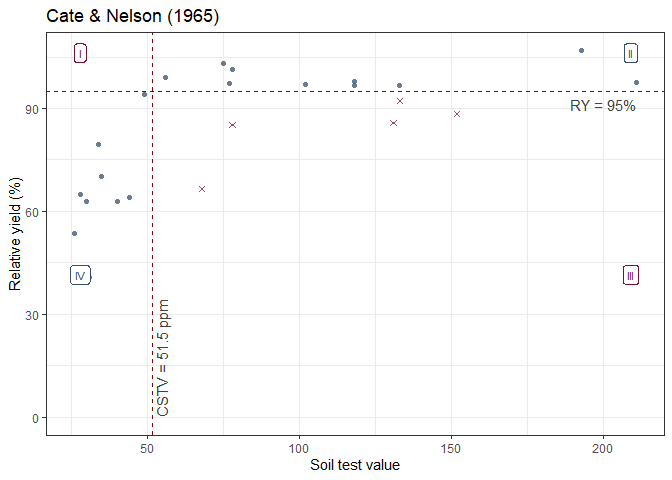
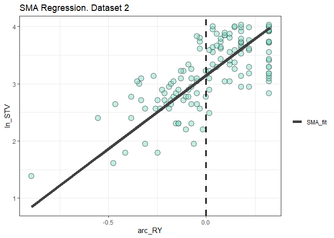

<!-- README.md is generated from README.Rmd. Please edit that file -->

# soiltestR: Soil Test Calibration in R

<!-- badges: start -->

[](https://ci.appveyor.com/project/adriancorrendo/soiltestR)
[](https://circleci.com/gh/adriancorrendo/soiltestR)
[](https://app.codecov.io/gh/adriancorrendo/modalcc?branch=main)
[](https://github.com/adriancorrendo/soiltestR/actions)
<!-- badges: end -->

# Description <br/>

The goal of `soiltestR` is to assist users on the analysis of
relationships between relative yield (RY) and soil test values (STV)
following different approaches. <br/>


<b> 1. modALCC() </b> <br/>

The first calibration method available is the Modified Arcsine-log
Calibration Curve (`modALCC()`) originally described by Dyson and
Conyers (2013) and modified by Correndo et al. (2017). This function
produces the estimation of critical soil test values (CSTV) for a target
relative yield (RY) with confidence intervals at adjustable confidence
levels. <br/>

Instructions <br/>

1.  Load your dataframe with soil test value (STV) and relative yield
    (RY) data. <br/>

2.  Specify the following arguments into the function -modALCC()-: <br/>

(a). `data` (optional), <br/>

(b). soil test value `STV` and relative yield `RY`, <br/>

(c). `target` of relative yield (e.g. 90%), <br/>

(d). desired `confidence` level (e.g. 0.95 for 1 - alpha(0.05)). Used
for the estimation of critical soil test value (CSTV) lower and upper
limits. <br/>

3.  Run and check results. <br/>

4.  Check residuals plot, and warnings related to potential leverage
    points. <br/>

5.  Adjust curve plots as desired. <br/>

`soiltestR` also allows users to implement the quadrants analysis
approach, also known as the Cate-Nelson analysis. There are two versions
of the Cate-Nelson technique: <br/>

<b> 1. cate.nelson.1965() </b> <br/>

The second alternative is based on Cate and Nelson (1965)
(`cate.nelson.1965()`). The first step of this method is to apply an
arbitrarily fixed value of RY as a target (y-axis) that divides the data
into two categories (below & equal or above RY target). In a second
stage, it estimates the CSTV (x-axis) as the minimum STV that divides
the data into four quadrants (target RY level combined with STV lower or
greater than the CSTV) maximizing the number of points under
well-classified quadrants (II, STV \>= CSTV & RY \>= RY target; and IV,
STV \< CSTV & RY \< RY target). This is also known as the “graphical”
version of the Cate-Nelson approach. <br/>

Instructions <br/>

1.  Load your dataframe with soil test value (STV) and relative yield
    (RY) data. <br/>

2.  Specify the following arguments into the function
    -cate.nelson.1965()-: <br/>

(a). `data` (optional), <br/>

(b). soil test value `STV` and relative yield `RY`, <br/>

(c). `target` of relative yield (e.g. 90%), <br/>

3.  Run and check results. <br/>

4.  Adjust plot as desired. <br/>

<b> 1. cate.nelson.1971() </b> <br/>

The third alternative is based on Cate and Nelson (1971)
(`cate.nelson.1971()`). The first step of this alternative version is to
estimates the CSTV (x-axis) as the minimum STV that minimizes the
residual sum of squares when dividing data points in two classes (lower
or greater than the CSTV) without using a fixed RY. This refined version
does not constrains the model performance (measured with the coefficient
of determination -R2-) but the user has no control on the RY level for
the CSTV. This is also known as the “statistical” version of the
Cate-Nelson approach. <br/>

Instructions <br/>

1.  Load your dataframe with soil test value (STV) and relative yield
    (RY) data. <br/>

2.  Specify the following arguments into the function
    -cate.nelson.1965()-: <br/>

(a). `data` (optional), <br/>

(b). soil test value `STV` and relative yield `RY`, <br/>

3.  Run and check results. <br/>

4.  Adjust plot as desired. <br/>

MORE FUNCTIONS COMING SOON…. <br/>

## 1. Installation

You can install the development version of modalcc from
[GitHub](https://github.com/adriancorrendo/soiltestR) with:

``` r
# install.packages("devtools")
devtools::install_github("adriancorrendo/soiltestR")
```

``` r
library(soiltestR)
```

## 2. Example

This is a basic example which shows you how to use the package:

Complementary libraries

``` r
# Other suggested packages
# Install if needed 
library(ggplot2) # Plots
library(ggpmisc)
library(dplyr) # Data wrangling
library(tidyr) # Data wrangling
library(purrr) # Mapping
```

### 2.1. Load a dataset

``` r
# Example 1 dataset
# Fake dataset manually created
data_1 = data.frame("RY" = c(65,80,85,88,90,94,93,96,97,95,98,100,99,99,100),
                   "STV" = c(1,2,3,4,5,6,7,8,9,10,11,12,13,14,15))
  

# Example 2. Native dataset from soiltestR package

data_2 = soiltestR::data_test


# Example 3. Native dataset from soiltestR package, used by Cate & Nelson (1971)
data_3 <- soiltestR::freitas1966

# Create nested structure as example of multiple datasets
# Note that STV column needs to have the same name in order to bind rows
data.all = bind_rows(data_1, data_2, 
                     data_3 %>% rename(STV = STK),
                     .id = "id") %>% 
  tidyr::nest(data = c("STV", "RY"))
```

## 3. Fit examples

### 3.1. Fit ALCC models individually

``` r
# RY target = 90%, confidence level = 0.95, replace with your desired values

# Data 1
# Using dataframe
fit_example_1 = soiltestR::modALCC(data = data_1, RY = RY, STV = STV, target=90, confidence = 0.95)
#> Warning: 7 STV points exceeded two-times (2x) 
#>   the CSTV for 90% of RY. Risk of leverage. You may consider a sensitivity analysis by 
#>   removing extreme points, re-run the modALCC(), and check results.
# Alternative using the vectors
#fit_example_1 = ALCC(RY = data_1$RY,STV = data_1$STV, target=90,confidence = 0.95)

fit_example_1
#> $n
#> [1] 15
#> 
#> $r
#> [1] 0.9682908
#> 
#> $target
#> [1] 90
#> 
#> $CSTV
#> [1] 4.478476
#> 
#> $LL
#> [1] 3.947041
#> 
#> $UL
#> [1] 5.081463
#> 
#> $confidence
#> [1] 0.95
#> 
#> $p_value
#> [1] 3.296044e-09
#> 
#> $CSTV90
#> [1] 4.478476
#> 
#> $n.90x2
#> [1] 7
#> 
#> $CSTV100
#> [1] 19.15054
#> 
#> $n.100
#> [1] 0
#> 
#> $Curve
#> $Curve[[1]]
#> # A tibble: 176 x 2
#>    RY.fitted STV.fitted
#>        <dbl>      <dbl>
#>  1      65         1.10
#>  2      65.2       1.11
#>  3      65.4       1.12
#>  4      65.6       1.13
#>  5      65.8       1.14
#>  6      66         1.15
#>  7      66.2       1.16
#>  8      66.4       1.17
#>  9      66.6       1.18
#> 10      66.8       1.20
#> # ... with 166 more rows
#> 
#> 
#> $SMA
#> $SMA[[1]]
#> # A tibble: 15 x 5
#>    ln_STV  arc_RY SMA_line residuals fitted_axis
#>     <dbl>   <dbl>    <dbl>     <dbl>       <dbl>
#>  1  0     -0.311    0.0934   -0.0934     -1.41  
#>  2  0.693 -0.142    0.858    -0.165       0.0523
#>  3  1.10  -0.0759   1.16     -0.0577      0.756 
#>  4  1.39  -0.0320   1.35      0.0315      1.24  
#>  5  1.61   0        1.50      0.110       1.61  
#>  6  1.79   0.0743   1.83     -0.0430      2.13  
#>  7  1.95   0.0540   1.74      0.203       2.19  
#>  8  2.08   0.120    2.04      0.0365      2.62  
#>  9  2.20   0.148    2.17      0.0311      2.86  
#> 10  2.30   0.0962   1.93      0.369       2.74  
#> 11  2.40   0.180    2.31      0.0864      3.21  
#> 12  2.48   0.322    2.95     -0.467       3.94  
#> 13  2.56   0.222    2.50      0.0650      3.57  
#> 14  2.64   0.222    2.50      0.139       3.64  
#> 15  2.71   0.322    2.95     -0.244       4.16

# Data 2
fit_example_2 = soiltestR::modALCC(data = data_2, RY = RY, STV = STV, target=90, confidence = 0.95)
#> Warning: 9 STV points exceeded the CSTV for 100% of RY.
#>   Risk of leverage. You may consider a sensitivity analysis by removing extreme points, 
#>   re-run the modALCC(), and check results.
#> Warning: 22 STV points exceeded two-times (2x) 
#>   the CSTV for 90% of RY. Risk of leverage. You may consider a sensitivity analysis by 
#>   removing extreme points, re-run the modALCC(), and check results.

fit_example_2
#> $n
#> [1] 137
#> 
#> $r
#> [1] 0.7164928
#> 
#> $target
#> [1] 90
#> 
#> $CSTV
#> [1] 23.25457
#> 
#> $LL
#> [1] 21.57156
#> 
#> $UL
#> [1] 25.06888
#> 
#> $confidence
#> [1] 0.95
#> 
#> $p_value
#> [1] 7.314913e-23
#> 
#> $CSTV90
#> [1] 23.25457
#> 
#> $n.90x2
#> [1] 22
#> 
#> $CSTV100
#> [1] 53.10299
#> 
#> $n.100
#> [1] 9
#> 
#> $Curve
#> $Curve[[1]]
#> # A tibble: 441 x 2
#>    RY.fitted STV.fitted
#>        <dbl>      <dbl>
#>  1      12         2.34
#>  2      12.2       2.36
#>  3      12.4       2.37
#>  4      12.6       2.39
#>  5      12.8       2.41
#>  6      13         2.43
#>  7      13.2       2.45
#>  8      13.4       2.47
#>  9      13.6       2.49
#> 10      13.8       2.50
#> # ... with 431 more rows
#> 
#> 
#> $SMA
#> $SMA[[1]]
#> # A tibble: 137 x 5
#>    ln_STV  arc_RY SMA_line residuals fitted_axis
#>     <dbl>   <dbl>    <dbl>     <dbl>       <dbl>
#>  1   1.39 -0.895     0.849     0.537      -0.911
#>  2   1.61 -0.474     1.93     -0.322       0.394
#>  3   1.79 -0.247     2.51     -0.721       1.16 
#>  4   1.79 -0.414     2.09     -0.293       0.730
#>  5   1.95 -0.0617    2.99     -1.04        1.79 
#>  6   1.95 -0.311     2.35     -0.402       1.15 
#>  7   2.20 -0.0163    3.10     -0.907       2.16 
#>  8   2.20 -0.103     2.88     -0.684       1.93 
#>  9   2.30 -0.154     2.75     -0.448       1.91 
#> 10   2.30 -0.142     2.78     -0.480       1.94 
#> # ... with 127 more rows

# Data 3. Freitas et al. 1966
fit_example_3 = soiltestR::modALCC(data = data_3, RY = RY, STV = STK, target=90, confidence = 0.95)
#> Warning: One or more original RY values exceeded 100%. All RY values greater 
#>           than 100% have been capped to 100%.
#> Warning: 2 STV points exceeded the CSTV for 100% of RY.
#>   Risk of leverage. You may consider a sensitivity analysis by removing extreme points, 
#>   re-run the modALCC(), and check results.
#> Warning: 2 STV points exceeded two-times (2x) 
#>   the CSTV for 90% of RY. Risk of leverage. You may consider a sensitivity analysis by 
#>   removing extreme points, re-run the modALCC(), and check results.

fit_example_3
#> $n
#> [1] 24
#> 
#> $r
#> [1] 0.7277644
#> 
#> $target
#> [1] 90
#> 
#> $CSTV
#> [1] 76.89175
#> 
#> $LL
#> [1] 62.34761
#> 
#> $UL
#> [1] 94.82868
#> 
#> $confidence
#> [1] 0.95
#> 
#> $p_value
#> [1] 5.567174e-05
#> 
#> $CSTV90
#> [1] 76.89175
#> 
#> $n.90x2
#> [1] 2
#> 
#> $CSTV100
#> [1] 170.7629
#> 
#> $n.100
#> [1] 2
#> 
#> $Curve
#> $Curve[[1]]
#> # A tibble: 297 x 2
#>    RY.fitted STV.fitted
#>        <dbl>      <dbl>
#>  1      40.8       19.4
#>  2      41         19.5
#>  3      41.2       19.6
#>  4      41.4       19.7
#>  5      41.6       19.8
#>  6      41.8       19.9
#>  7      42         20.0
#>  8      42.2       20.1
#>  9      42.4       20.2
#> 10      42.6       20.3
#> # ... with 287 more rows
#> 
#> 
#> $SMA
#> $SMA[[1]]
#> # A tibble: 24 x 5
#>    ln_STV  arc_RY SMA_line residuals fitted_axis
#>     <dbl>   <dbl>    <dbl>     <dbl>       <dbl>
#>  1   3.26 -0.429      3.28   -0.0214        2.20
#>  2   3.33 -0.313      3.57   -0.233         2.56
#>  3   3.40 -0.332      3.52   -0.118         2.58
#>  4   3.43 -0.556      2.96    0.471         2.05
#>  5   3.53 -0.148      3.98   -0.449         3.16
#>  6   3.56 -0.255      3.71   -0.156         2.92
#>  7   3.69 -0.332      3.52    0.170         2.87
#>  8   3.78 -0.322      3.54    0.240         2.99
#>  9   3.89  0.0743     4.53   -0.635         4.08
#> 10   4.03  0.222      4.89   -0.867         4.57
#> # ... with 14 more rows
```

### 3.1.2. Fit multiple ALCC models with mapping

``` r
# Run multiple examples at once with map()
fit_examples = data.all %>%
  mutate(modALCC = map(data, ~ soiltestR::modALCC(RY = .$RY, STV = .$STV, target=90, confidence = 0.95)))
#> Warning: 7 STV points exceeded two-times (2x) 
#>   the CSTV for 90% of RY. Risk of leverage. You may consider a sensitivity analysis by 
#>   removing extreme points, re-run the modALCC(), and check results.
#> Warning: 9 STV points exceeded the CSTV for 100% of RY.
#>   Risk of leverage. You may consider a sensitivity analysis by removing extreme points, 
#>   re-run the modALCC(), and check results.
#> Warning: 22 STV points exceeded two-times (2x) 
#>   the CSTV for 90% of RY. Risk of leverage. You may consider a sensitivity analysis by 
#>   removing extreme points, re-run the modALCC(), and check results.
#> Warning: One or more original RY values exceeded 100%. All RY values greater 
#>           than 100% have been capped to 100%.
#> Warning: 2 STV points exceeded the CSTV for 100% of RY.
#>   Risk of leverage. You may consider a sensitivity analysis by removing extreme points, 
#>   re-run the modALCC(), and check results.
#> Warning: 2 STV points exceeded two-times (2x) 
#>   the CSTV for 90% of RY. Risk of leverage. You may consider a sensitivity analysis by 
#>   removing extreme points, re-run the modALCC(), and check results.

head(fit_examples)
#> # A tibble: 3 x 3
#>   id    data               modALCC          
#>   <chr> <list>             <list>           
#> 1 1     <tibble [15 x 2]>  <named list [14]>
#> 2 2     <tibble [137 x 2]> <named list [14]>
#> 3 3     <tibble [24 x 2]>  <named list [14]>

# Alternative with group_map, this does not required nested data.
fit_all = bind_rows(data_1, data_2, .id = "id") %>% 
  group_by(id) %>% 
  group_map(~ soiltestR::modALCC(data = ., RY = RY, STV = STV, target = 90, confidence = 0.95))
#> Warning: 7 STV points exceeded two-times (2x) 
#>   the CSTV for 90% of RY. Risk of leverage. You may consider a sensitivity analysis by 
#>   removing extreme points, re-run the modALCC(), and check results.
#> Warning: 9 STV points exceeded the CSTV for 100% of RY.
#>   Risk of leverage. You may consider a sensitivity analysis by removing extreme points, 
#>   re-run the modALCC(), and check results.
#> Warning: 22 STV points exceeded two-times (2x) 
#>   the CSTV for 90% of RY. Risk of leverage. You may consider a sensitivity analysis by 
#>   removing extreme points, re-run the modALCC(), and check results.

head(fit_all)
#> [[1]]
#> [[1]]$n
#> [1] 15
#> 
#> [[1]]$r
#> [1] 0.9682908
#> 
#> [[1]]$target
#> [1] 90
#> 
#> [[1]]$CSTV
#> [1] 4.478476
#> 
#> [[1]]$LL
#> [1] 3.947041
#> 
#> [[1]]$UL
#> [1] 5.081463
#> 
#> [[1]]$confidence
#> [1] 0.95
#> 
#> [[1]]$p_value
#> [1] 3.296044e-09
#> 
#> [[1]]$CSTV90
#> [1] 4.478476
#> 
#> [[1]]$n.90x2
#> [1] 7
#> 
#> [[1]]$CSTV100
#> [1] 19.15054
#> 
#> [[1]]$n.100
#> [1] 0
#> 
#> [[1]]$Curve
#> [[1]]$Curve[[1]]
#> # A tibble: 176 x 2
#>    RY.fitted STV.fitted
#>        <dbl>      <dbl>
#>  1      65         1.10
#>  2      65.2       1.11
#>  3      65.4       1.12
#>  4      65.6       1.13
#>  5      65.8       1.14
#>  6      66         1.15
#>  7      66.2       1.16
#>  8      66.4       1.17
#>  9      66.6       1.18
#> 10      66.8       1.20
#> # ... with 166 more rows
#> 
#> 
#> [[1]]$SMA
#> [[1]]$SMA[[1]]
#> # A tibble: 15 x 5
#>    ln_STV  arc_RY SMA_line residuals fitted_axis
#>     <dbl>   <dbl>    <dbl>     <dbl>       <dbl>
#>  1  0     -0.311    0.0934   -0.0934     -1.41  
#>  2  0.693 -0.142    0.858    -0.165       0.0523
#>  3  1.10  -0.0759   1.16     -0.0577      0.756 
#>  4  1.39  -0.0320   1.35      0.0315      1.24  
#>  5  1.61   0        1.50      0.110       1.61  
#>  6  1.79   0.0743   1.83     -0.0430      2.13  
#>  7  1.95   0.0540   1.74      0.203       2.19  
#>  8  2.08   0.120    2.04      0.0365      2.62  
#>  9  2.20   0.148    2.17      0.0311      2.86  
#> 10  2.30   0.0962   1.93      0.369       2.74  
#> 11  2.40   0.180    2.31      0.0864      3.21  
#> 12  2.48   0.322    2.95     -0.467       3.94  
#> 13  2.56   0.222    2.50      0.0650      3.57  
#> 14  2.64   0.222    2.50      0.139       3.64  
#> 15  2.71   0.322    2.95     -0.244       4.16  
#> 
#> 
#> 
#> [[2]]
#> [[2]]$n
#> [1] 137
#> 
#> [[2]]$r
#> [1] 0.7164928
#> 
#> [[2]]$target
#> [1] 90
#> 
#> [[2]]$CSTV
#> [1] 23.25457
#> 
#> [[2]]$LL
#> [1] 21.57156
#> 
#> [[2]]$UL
#> [1] 25.06888
#> 
#> [[2]]$confidence
#> [1] 0.95
#> 
#> [[2]]$p_value
#> [1] 7.314913e-23
#> 
#> [[2]]$CSTV90
#> [1] 23.25457
#> 
#> [[2]]$n.90x2
#> [1] 22
#> 
#> [[2]]$CSTV100
#> [1] 53.10299
#> 
#> [[2]]$n.100
#> [1] 9
#> 
#> [[2]]$Curve
#> [[2]]$Curve[[1]]
#> # A tibble: 441 x 2
#>    RY.fitted STV.fitted
#>        <dbl>      <dbl>
#>  1      12         2.34
#>  2      12.2       2.36
#>  3      12.4       2.37
#>  4      12.6       2.39
#>  5      12.8       2.41
#>  6      13         2.43
#>  7      13.2       2.45
#>  8      13.4       2.47
#>  9      13.6       2.49
#> 10      13.8       2.50
#> # ... with 431 more rows
#> 
#> 
#> [[2]]$SMA
#> [[2]]$SMA[[1]]
#> # A tibble: 137 x 5
#>    ln_STV  arc_RY SMA_line residuals fitted_axis
#>     <dbl>   <dbl>    <dbl>     <dbl>       <dbl>
#>  1   1.39 -0.895     0.849     0.537      -0.911
#>  2   1.61 -0.474     1.93     -0.322       0.394
#>  3   1.79 -0.247     2.51     -0.721       1.16 
#>  4   1.79 -0.414     2.09     -0.293       0.730
#>  5   1.95 -0.0617    2.99     -1.04        1.79 
#>  6   1.95 -0.311     2.35     -0.402       1.15 
#>  7   2.20 -0.0163    3.10     -0.907       2.16 
#>  8   2.20 -0.103     2.88     -0.684       1.93 
#>  9   2.30 -0.154     2.75     -0.448       1.91 
#> 10   2.30 -0.142     2.78     -0.480       1.94 
#> # ... with 127 more rows
```

### 3.2. Fit Cate & Nelson 1965

``` r
cate.nelson.1965_example_2 = soiltestR::cate.nelson.1965(data = data_2, RY = RY, STV = STV, target=90)

cate.nelson.1965_example_2
#> $n
#> [1] 137
#> 
#> $CRYV
#> [1] 90
#> 
#> $CSTV
#> [1] 23
#> 
#> $quadrants
#>   q.I q.II q.III q.IV positive negative
#> 1  11   67     9   50      117       20
#> 
#> $X2
#> 
#>  Pearson's Chi-squared test with Yates' continuity correction
#> 
#> data:  data.frame(row.1, row.2)
#> X-squared = 65.038, df = 1, p-value = 7.347e-16
#> 
#> 
#> $anova
#> Analysis of Variance Table
#> 
#> Response: y
#>            Df Sum Sq Mean Sq F value    Pr(>F)    
#> xgroup      1  11106 11106.1  87.656 2.322e-16 ***
#> Residuals 135  17105   126.7                      
#> ---
#> Signif. codes:  0 '***' 0.001 '**' 0.01 '*' 0.05 '.' 0.1 ' ' 1
#> 
#> $R2
#> [1] 0.3936824
#> 
#> $plot
#> Warning: Use of `dataset$Quadrant` is discouraged. Use `Quadrant` instead.
#> Use of `dataset$Quadrant` is discouraged. Use `Quadrant` instead.
```


``` r
cate.nelson.1965_example_3 = soiltestR::cate.nelson.1965(data = data_3, RY = RY, STV = STK, target=95)
#> Warning in stats::chisq.test(data.frame(row.1, row.2)): Chi-squared
#> approximation may be incorrect

cate.nelson.1965_example_3
#> $n
#> [1] 24
#> 
#> $CRYV
#> [1] 95
#> 
#> $CSTV
#> [1] 51.5
#> 
#> $quadrants
#>   q.I q.II q.III q.IV positive negative
#> 1   0   10     5    9       19        5
#> 
#> $X2
#> 
#>  Pearson's Chi-squared test with Yates' continuity correction
#> 
#> data:  data.frame(row.1, row.2)
#> X-squared = 7.7257, df = 1, p-value = 0.005444
#> 
#> 
#> $anova
#> Analysis of Variance Table
#> 
#> Response: y
#>           Df Sum Sq Mean Sq F value    Pr(>F)    
#> xgroup     1 4484.5  4484.5  31.615 1.183e-05 ***
#> Residuals 22 3120.7   141.8                      
#> ---
#> Signif. codes:  0 '***' 0.001 '**' 0.01 '*' 0.05 '.' 0.1 ' ' 1
#> 
#> $R2
#> [1] 0.5896666
#> 
#> $plot
#> Warning: Use of `dataset$Quadrant` is discouraged. Use `Quadrant` instead.
#> Use of `dataset$Quadrant` is discouraged. Use `Quadrant` instead.
```

 \###
3.3. Fit Cate & Nelson 1971

``` r
cate.nelson.1971_example_2 = soiltestR::cate.nelson.1971(data = data_2, RY = RY, STV = STV)

cate.nelson.1971_example_2
#> $n
#> [1] 137
#> 
#> $CRYV
#> [1] 87.5
#> 
#> $CSTV
#> [1] 22.5
#> 
#> $quadrants
#>   q.I q.II q.III q.IV positive negative
#> 1  13   70     6   48      118       19
#> 
#> $X2
#> 
#>  Pearson's Chi-squared test with Yates' continuity correction
#> 
#> data:  data.frame(row.1, row.2)
#> X-squared = 68.087, df = 1, p-value < 2.2e-16
#> 
#> 
#> $anova
#> Analysis of Variance Table
#> 
#> Response: y
#>            Df Sum Sq Mean Sq F value    Pr(>F)    
#> xgroup      1  11106 11106.1  87.656 2.322e-16 ***
#> Residuals 135  17105   126.7                      
#> ---
#> Signif. codes:  0 '***' 0.001 '**' 0.01 '*' 0.05 '.' 0.1 ' ' 1
#> 
#> $R2
#> [1] 0.3936824
#> 
#> $plot
#> Warning: Use of `dataset$Quadrant` is discouraged. Use `Quadrant` instead.
#> Use of `dataset$Quadrant` is discouraged. Use `Quadrant` instead.
```


``` r
cate.nelson.1965_example_3 = soiltestR::cate.nelson.1971(data = data_3, RY = RY, STV = STK)
#> Warning in stats::chisq.test(data.frame(row.1, row.2)): Chi-squared
#> approximation may be incorrect

cate.nelson.1965_example_3
#> $n
#> [1] 24
#> 
#> $CRYV
#> [1] 82.4
#> 
#> $CSTV
#> [1] 46.5
#> 
#> $quadrants
#>   q.I q.II q.III q.IV positive negative
#> 1   0   15     1    8       23        1
#> 
#> $X2
#> 
#>  Pearson's Chi-squared test with Yates' continuity correction
#> 
#> data:  data.frame(row.1, row.2)
#> X-squared = 16.2, df = 1, p-value = 5.699e-05
#> 
#> 
#> $anova
#> Analysis of Variance Table
#> 
#> Response: y
#>           Df Sum Sq Mean Sq F value    Pr(>F)    
#> xgroup     1 5374.2  5374.2  52.997 2.724e-07 ***
#> Residuals 22 2230.9   101.4                      
#> ---
#> Signif. codes:  0 '***' 0.001 '**' 0.01 '*' 0.05 '.' 0.1 ' ' 1
#> 
#> $R2
#> [1] 0.7066536
#> 
#> $plot
#> Warning: Use of `dataset$Quadrant` is discouraged. Use `Quadrant` instead.
#> Use of `dataset$Quadrant` is discouraged. Use `Quadrant` instead.
```



## 4. modALCC plots

Examples using ggplot <br/>

### 4.1. Example 1

``` r
# Extracting curve data as a data.frame to plot
curve_example1 = as.data.frame(fit_example_1$Curve)


# Plot
data_1 %>% 
  # Want to remove leverage points?
  #dplyr::filter(STV < fit_example_1$CSTV100) %>% 
  #dplyr::filter(STV < 2*fit_example_1$CSTV90) %>% 
  ggplot()+
  # Points
  geom_point(aes(x = STV, y = RY), fill = "orange", shape = 21, size = 4, alpha = 0.75)+
  # Highlight potential leverage points >2xCSTV90
  geom_point(data = data_1 %>% dplyr::filter(STV > 2*fit_example_1$CSTV90),
             aes(x = STV, y = RY, shape = ">2xCSTV90"), col = "dark red", size = 5, alpha = 1)+
  # Highlight potential leverage points >2xCSTV90
  #geom_point(data = data_1 %>% dplyr::filter(STV > fit_example_1$CSTV100),
   #          aes(x = STV, y = RY, shape = ">CSTV100"), col = "dark red", size = 4, alpha = 1)+
  scale_shape_manual(name = "", values = c(5,4))+
  # Fitted ALCC
  geom_line(data = curve_example1, aes(x= STV.fitted, y = RY.fitted), size = 2)+
  # Critical value
  geom_vline(xintercept = fit_example_1$CSTV, col = "red", size = 1.25, linetype = "dashed")+
  # Confidence limits
  # Lines
  geom_vline(xintercept = fit_example_1$LL, col = "red", size = 0.75, linetype = "dotted")+
  geom_vline(xintercept = fit_example_1$UL, col = "red", size = 0.75, linetype = "dotted")+
  # Shade
  ggpp::annotate(geom = "rect", xmin = fit_example_1$LL, xmax = fit_example_1$UL,
                 ymin = min(data_1$RY), ymax = 100, alpha = .3, fill = "red")+
  # Axis titles
  labs(x = "Soil Test Value (units)", y = "Relative Yield (%)",
       title = "Modified Arcsine-Log Calibration Curve")+
  theme_bw()+
  theme(legend.position = "top")+
  # Annotate critical values data
  ggpp::annotate(geom = "table", y = min(data_1$RY), x = fit_example_1$UL + 0.5, hjust= 0, vjust = 0,
                 label = as.data.frame(fit_example_1[c("CSTV", "LL", "UL", "r")]) %>% 
                   mutate_at(.vars = c("r"), ~round(.,2)) %>% 
                   mutate_at(.vars = c("CSTV","LL","UL"), ~round(.,1))
                   )
```


``` r

# SMA regression

SMA_example1 = fit_example_1$SMA %>% as.data.frame()
 
SMA_example1 %>% 
  ggplot(aes(x = arc_RY, y = ln_STV))+
  ggtitle("SMA Regression. Dataset 1")+
  geom_point(shape=21, fill = "orange", size = 4, alpha = 0.75)+
  #SMA Line
  geom_path(aes(x=arc_RY, y = SMA_line, linetype = "SMA_fit"), size = 2, col = "grey25")+
  scale_linetype_manual(name="", values = c("solid"))+
  #Critical value
  geom_vline(xintercept = 0, col = "grey10", size = 1.25, linetype = "dashed")+
  theme_bw()+
  # Axis titles
  labs(y = "ln_STV", y = "asin(sqrt(RY))-centered")
```


``` r
# Residuals plot

SMA_example1 %>% 
  ggplot(aes(x = fitted_axis, y = residuals))+
  ggtitle("Residuals SMA. Dataset 1")+
  geom_point(shape=21, fill = "orange", size = 4, alpha = 0.75)+
  geom_hline(yintercept = 0, col = "grey10", size = 1.25, linetype = "dashed")+
  theme_bw()+
  # Axis titles
  labs(x = "Fitted Axis -SMA- (see Warton et al. 2006)", y = "Residuals (STV units)")
```


### 4.2. Example 2

``` r
# Extracting curve data as a data.frame to plot
curve_example2 = fit_example_2$Curve %>% as.data.frame()

# Plot
data_2 %>% ggplot()+
  # Want to remove leverage points?
  #dplyr::filter(STV < fit_example_2$CSTV100) %>% 
  #dplyr::filter(STV < 2*fit_example_2$CSTV90) %>% 
  # Points
  geom_point(aes(x = STV, y = RY), fill = "#88dbc8", shape = 21, size = 4, alpha = 0.75)+
  # Highlight potential leverage points >2xCSTV90
  geom_point(data = data_2 %>% dplyr::filter(STV > 2*fit_example_2$CSTV90),
             aes(x = STV, y = RY, shape = ">2xCSTV90"), col = "dark red", size = 5, alpha = 1)+
  # Highlight potential leverage points >CSTV100
  geom_point(data = data_2 %>% dplyr::filter(STV > fit_example_2$CSTV100),
             aes(x = STV, y = RY, shape = ">CSTV100"), col = "dark red", size = 5, alpha = 1)+
  scale_shape_manual(name = "", values = c(5,4))+
  # Fitted ALCC
  geom_line(data = curve_example2, aes(x= STV.fitted, y = RY.fitted), size = 2)+
  # Critical value
  geom_vline(xintercept = fit_example_2$CSTV, col = "red", size = 1.25, linetype = "dashed")+
  # Confidence limits
  geom_vline(xintercept = fit_example_2$LL, col = "red", size = 0.75, linetype = "dotted")+
  geom_vline(xintercept = fit_example_2$UL, col = "red", size = 0.75, linetype = "dotted")+
  ggpp::annotate(geom = "rect", xmin = fit_example_2$LL, xmax = fit_example_2$UL,
                 ymin = min(data_2$RY), ymax = 100, alpha = .3, fill = "red")+
  # Axis titles
  labs(x = "Soil Test Value (units)", y = "Relative Yield (%)",
       title = "Modified Arcsine-Log Calibration Curve")+
  theme_bw()+
  theme(legend.position = "top")+
  # Annotate critical values data
  ggpp::annotate(geom = "table", y = min(data_2$RY), x = fit_example_2$UL + 0.5, hjust= 0, vjust = 0,
                 label = as.data.frame(fit_example_2[c("CSTV", "LL", "UL", "r")]) %>% 
                   mutate_at(.vars = c("r"), ~round(.,2)) %>% 
                   mutate_at(.vars = c("CSTV","LL","UL"), ~round(.,1))
                   )
```


``` r
  
# SMA regression

SMA_example2 = fit_example_2$SMA %>% as.data.frame() 

SMA_example2 %>% 
  ggplot(aes(x = arc_RY, y = ln_STV))+
  ggtitle("SMA Regression. Dataset 2")+
  geom_point(shape=21, fill = "#88dbc8", size = 4, alpha = 0.5)+
  #SMA Line
  geom_path(aes(x=arc_RY, y = SMA_line, linetype = "SMA_fit"), size = 2, col = "grey25")+
  scale_linetype_manual(name="", values = c("solid"))+
  #Critical value
  geom_vline(xintercept = 0, col = "grey10", size = 1.25, linetype = "dashed")+
  theme_bw()+
  # Axis titles
  labs(y = "ln_STV", y = "asin(sqrt(RY))-centered")
```


``` r
# Residuals plot

SMA_example2 %>% 
  ggplot(aes(x = fitted_axis, y = residuals))+
  ggtitle("Residuals SMA. Dataset 2")+
  geom_point(shape = 21, fill = "#88dbc8", size = 4, alpha = 0.5)+
  geom_hline(yintercept = 0, col = "grey10", size = 1.25, linetype = "dashed")+
  theme_bw()+
  # Axis titles
  labs(x = "Fitted Axis -SMA- (see Warton et al. 2006)", y = "Residuals (STV units)")
```


<b> References </b> <br/>

*Correndo, A.A., Salvagiotti, F., García, F.O. and Gutiérrez-Boem, F.H.,
2017. A modification of the arcsine–log calibration curve for analysing
soil test value–relative yield relationships. Crop and Pasture Science,
68(3), pp.297-304. <https://doi.org/10.1071/CP16444> * <br/>

*Cate, R.B. Jr., and Nelson, L.A., 1965. A rapid method for correlation
of soil test analysis with plant response data. North Carolina Agric.
Exp. Stn., International soil Testing Series Bull. No. 1. * <br/>

*Cate, R.B. Jr., and Nelson, L.A., 1971. A simple statistical procedure
for partitioning soil test correlation data into two classes. Soil Sci.
Soc. Am. Proc. 35:658-659 * <br/>

*Dyson, C.B., Conyers, M.K., 2013. Methodology for online biometric
analysis of soil test-crop response datasets. Crop & Pasture Science 64:
435–441. <https://doi.org/10.1071/CP13009> * <br/>

*Warton, D.I., Wright, I.J., Falster, D.S., Westoby, M., 2006. Bivariate
line-fitting methods for allometry. Biol. Rev. Camb. Philos. Soc. 81,
259–291. <https://doi.org/10.1017/S1464793106007007> * <br/>
